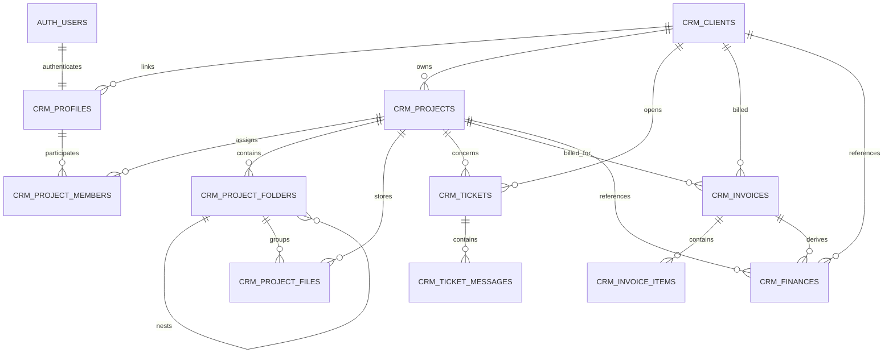

# TechMigos Website — Codebase Reference

> **Audit date:** 2026-09-16
> **Repository:** `TechmigosWebsite`
> **Branch audited:** `main`
> **Purpose:** durable, source-grounded reference for future development in this repository.

This file is the application-specific reference to read before making changes. It describes the code that exists in the repository today, the runtime data flows, the final Supabase security model, and the known gaps that affect future work.

It is intentionally separate from [`knowledge_Astro.md`](knowledge_Astro.md). That file is a generic Astro v4 knowledge base and is not an accurate application map for this project, which currently declares Astro 6 in [`package.json`](package.json).

## How to use this document

Use the actual source files and the latest Supabase migration as the final authority if this document ever becomes stale. The practical precedence is:

1. Current source under `src/`, `public/`, `scripts/`, and `supabase/functions/`.
2. The final migration state under [`supabase/migrations/`](supabase/migrations/), especially the September 2026 RBAC migrations.
3. Automated tests under [`test/`](test/).
4. This document and older planning/audit documents.

Do not copy credentials, service-role keys, or production secrets into this file. Public Supabase URL/key names are documented only by variable name and purpose.

## Executive summary

TechMigos is an Astro website deployed as a static Vercel site. It combines:

- Public marketing and portfolio pages rendered by Astro.
- Public browser-side forms that write directly to Supabase tables under RLS.
- Supabase Auth for company and client login.
- A client portal at `/client`.
- A retained legacy operations portal shell under `src/features/operations/`.
- A newer, very large CRM/Finance shell in [`src/layouts/CrmLayout.astro`](src/layouts/CrmLayout.astro), now used by every `/company` feature route.
- Supabase Storage for resumes, finance proofs, invoice assets, signatures, and project files.
- One Supabase Edge Function, `admin-users`, for privileged Auth/profile administration.

The application is mostly a static document shell with substantial inline browser JavaScript. Astro produces the HTML; the browser then initializes Supabase, authenticates the user, loads CRM records, and hydrates or replaces parts of the page.

The current tree has two important inconsistencies that future work must resolve deliberately:

- **The source still contains many public and legacy company routes, while the current Playwright test expects them to return 404 and expects Finance to be the only retained CRM frontend.** See [Route status and source/test mismatch](#route-status-and-sourcetest-mismatch).
- **The repository has no `src/content/` directory, but blog, careers, and sitemap code imports `astro:content`.** This is a likely build blocker once dependencies are installed. See [Content collections](#content-collections).

## System architecture


### Runtime boundaries

| Boundary | Responsibility | Important implementation |
|---|---|---|
| Astro build | Generates static pages, metadata, content-driven pages, and sitemap files | `output: 'static'` in [`astro.config.mjs`](astro.config.mjs) |
| Shared layout | SEO, fonts/preconnects, Supabase initialization, CRM repository bootstrap, site-wide motion | [`src/layouts/BaseLayout.astro`](src/layouts/BaseLayout.astro) |
| Public browser code | Marketing interactions and direct public form submissions | Inline scripts in page/component files |
| CRM browser code | Authenticated reads/writes, rendering, modals, filters, project-drive files/previews, invoices, reports | [`src/layouts/CrmLayout.astro`](src/layouts/CrmLayout.astro), [`public/techmigos-ops/scripts/operations-app.js`](public/techmigos-ops/scripts/operations-app.js) |
| Shared repository | Normalizes the browser-side `/api/portal/...` contract into Supabase operations | [`src/lib/crm/repository.js`](src/lib/crm/repository.js) |
| Database | Durable authorization, relationships, constraints, ledger triggers, and RLS | [`supabase/migrations/`](supabase/migrations/) |
| Edge Function | Privileged Auth user creation/invitation/profile changes | [`supabase/functions/admin-users/index.ts`](supabase/functions/admin-users/index.ts) |

There are no Astro API route files under `src/pages/api/`. The `/api/portal/...` paths are an internal repository abstraction used by browser code; they are parsed by `createCrmRepository()` and are not HTTP endpoints served by Astro.

## Repository map

| Path | Role |
|---|---|
| `src/pages/` | Public, auth, client, company, and sitemap routes |
| `src/layouts/BaseLayout.astro` | Shared public/CRM document layout and global browser bootstrap |
| `src/layouts/CrmLayout.astro` | Large CRM application shell, CSS, state, renderers, and event handlers |
| `src/features/operations/` | Legacy operations portal shell, mock data, icons, and portal-specific CSS |
| `src/components/` | Shared navigation, footer, service, portfolio-focus, and CRM chrome components |
| `src/lib/crm/repository.js` | Supabase repository and internal portal request router |
| `src/lib/crm/permissions.js` | Client-side role/resource guard |
| `src/lib/crm/finance.js` | Finance/invoice calculation and classification helpers |
| `src/lib/siteContent.ts` | File-backed portfolio/client/testimonial content loader and sanitizer |
| `src/db/supabase.js` | Separate module-level Supabase client export |
| `src/scripts/crm-pdf.js` | jsPDF report generation/download helper |
| `src/styles/global.css` | Global marketing/base styles and design tokens |
| `src/styles/operations.css` | Shared CRM/Finance shell styles, navigation parity, responsive layout, and project-drive UI |
| `src/features/operations/styles/operations-portal.css` | Legacy operations shell styles; approximately 404 lines |
| `public/techmigos-ops/scripts/operations-app.js` | Legacy operations behavior and live hydration |
| `public/techmigos-ops/scripts/api-client.js` | Legacy wrapper around the CRM repository |
| `supabase/migrations/` | Schema, RLS, storage, triggers, and RPC history |
| `supabase/functions/admin-users/` | Server-side privileged user administration |
| `data/site-content.json` | Mutable file-backed site content used at build/runtime |
| `data/leads.json` | Present data artifact; current public contact flow writes to Supabase instead |
| `test/crm-rbac-finance.test.js` | Node tests for permissions, repository behavior, finance, and PDF export |
| `test/e2e/portal.spec.js` | Playwright login/route/access/Finance assertions; currently out of sync with source routes |
| `scripts/validate-site.mjs` | Post-build required-file, forbidden-reference, and SEO validation |

## Technology and configuration

### Package stack

Declared in [`package.json`](package.json):

- Astro `^6.3.3`, static output.
- `@supabase/supabase-js` `^2.108.2`.
- Tailwind CSS 3, PostCSS, Autoprefixer.
- `lucide-react`, although most application icons are inline SVG or custom Astro components.
- Sharp for Astro image service.
- jsPDF and jsPDF AutoTable for CRM report PDFs.
- Playwright for E2E tests.
- TypeScript with Astro strict configuration.
- `@vercel/speed-insights` in the shared layout.

### Commands

| Command | Purpose |
|---|---|
| `npm run dev` | Astro development server |
| `npm run build` | Static production build |
| `npm run preview` / `npm start` | Serve the built `dist/` directory |
| `npm test` | Runs `node --test test/*.test.js` |
| `npm run test:e2e` | Runs Playwright tests in `test/e2e/` |
| `npm run validate` | Runs `npm run build` then `scripts/validate-site.mjs` |
| `npm run leads:list` | Lists leads using `scripts/lead-management.mjs` |
| `npm run leads:export` | Exports leads using `scripts/lead-management.mjs` |
| `npm run portal:user` | Runs `scripts/provision-portal-user.mjs` |
| `npm run release:github` | Executes the release shell script |
| `npm run vercel:link` / `vercel:pull` / `vercel:env:pull` | Vercel project/env helpers |

Dependencies are installed in the current workspace. On 2026-09-16, `npm test`, `npm run build`, and `npm run validate` completed successfully; the remaining build warnings are the pre-existing empty content collections and the `/portfolio/hastkala` route conflict documented below.

### Astro and Vite configuration

[`astro.config.mjs`](astro.config.mjs) defines:

- `output: 'static'`.
- Site URL from `PUBLIC_SITE_URL`, defaulting to `https://www.techmigos.com`.
- Sharp image service.
- Remote image domains `images.unsplash.com` and `picsum.photos`.
- `lucide-react` as a Vite SSR `noExternal` dependency.

[`tsconfig.json`](tsconfig.json) extends Astro strict config and defines `@/*` as an alias for `./src/*`. Most existing imports use relative paths instead of the alias.

[`tailwind.config.cjs`](tailwind.config.cjs) scans `src/**/*.{astro,html,js,jsx,md,mdx,svelte,ts,tsx,vue}`. It defines Inter, Syne, and monospace families; primary indigo, accent cyan, and gold colors; motion keyframes; glow shadows; and utility classes such as `.perspective`, `.preserve-3d`, `.line-clamp-2`, `.text-balance`, and `.content-auto`.

### Environment variables

Names are listed in [`env.example.json`](env.example.json). Use `.env.local` for local secrets/configuration and never hardcode values in source.

| Variable | Classification | Use |
|---|---|---|
| `PUBLIC_SITE_URL` | Public | Astro canonical/site URL |
| `PUBLIC_API_BASE_URL` | Public/config | Optional legacy API base; currently the shared browser API fallback is empty |
| `PUBLIC_SUPABASE_URL` | Public | Supabase project URL |
| `PUBLIC_SUPABASE_KEY` | Public/publishable | Browser Supabase key; still keep it in environment configuration |
| `CSRF_SECRET` | Secret | Intended server-side CSRF HMAC secret; no current Astro API route consumes it |
| `ALLOWED_ORIGINS` | Server/config | Intended origin allowlist |
| `LEAD_NOTIFICATION_EMAIL` | Server/config | Intended lead notification target |
| `MSG91_AUTH_KEY` | Secret | Intended MSG91 provider authentication |
| `MSG91_EMAIL_DOMAIN`, `MSG91_EMAIL_FROM`, `MSG91_EMAIL_TO_NAME` | Server/config | Intended email sender configuration |
| `MSG91_*_TEMPLATE_ID` | Server/config | Intended notification template IDs |
| `CAREER_UPLOAD_DIR` | Server/config | Optional filesystem directory for the unused `careerUploads.ts` helper |
| `SITE_CONTENT_PATH` | Server/build config | Overrides `data/site-content.json` path |
| `FEATURED_PROJECT_ORDER` | Not currently read | `siteContent.ts` has a hard-coded featured order map instead |

`SUPABASE_SERVICE_ROLE_KEY` is required by the deployed Edge Function runtime but is not a browser variable and is intentionally not listed as a client-side configuration value. Never expose it in `vercel.json`, `.env.local` delivered to the browser, or Markdown documentation.

### Vercel behavior

[`vercel.json`](vercel.json):

- Builds with `npm run build:vercel` and serves `dist`.
- Sets the public site/Supabase variables needed by the static build.
- Redirects `techmigos.com` to `https://www.techmigos.com/:path*`.
- Adds `X-Content-Type-Options: nosniff`, `X-Frame-Options: SAMEORIGIN`, strict-origin referrer policy, and a Permissions Policy disabling camera, microphone, and geolocation.
- Gives `/_astro/*` and `/images/*` immutable one-year caching.

The current `.gitignore` has a secrets comment but does not contain an explicit `.env.local` rule. Verify local secret files are ignored before adding them.

## Route inventory

All routes below are represented by current files unless marked otherwise. Astro static output means these are generated at build time; auth and data authorization happen in the browser/Backend after load.

### Public website

| URL | Source | Layout/data | Behavior |
|---|---|---|---|
| `/` | `src/pages/index.astro` | `BaseLayout`, `loadSiteContent()` | Home hero, services, stats, featured work, process, CTA; testimonials are currently disabled with `showTestimonials = false` |
| `/about` | `src/pages/about.astro` | `BaseLayout` | Static company story, milestones, values, technology section |
| `/services` | `src/pages/services.astro` | `BaseLayout` | Static service catalogue, FAQ, contact links; service IDs become contact query parameters |
| `/portfolio` | `src/pages/portfolio/index.astro` | `BaseLayout`, `loadSiteContent()` | Filters project cards by category in browser |
| `/portfolio/[slug]` | `src/pages/portfolio/[slug].astro` | `BaseLayout`, `getStaticPaths`, `loadSiteContent()` | Generated case-study detail pages |
| `/portfolio/focus-today` | `src/pages/portfolio/focus-today.astro` | Focus portfolio components | Curated product showcase |
| `/portfolio/focusflow` | `src/pages/portfolio/focusflow.astro` | Focus portfolio components | Curated product showcase |
| `/portfolio/hastkala` | `src/pages/portfolio/hastkala.astro` | Focus portfolio components | Curated product showcase |
| `/portfolio/notiva` | `src/pages/portfolio/notiva.astro` | Focus portfolio components | Curated product showcase |
| `/portfolio/spendscanr` | `src/pages/portfolio/spendscanr.astro` | Focus portfolio components | Curated product showcase |
| `/portfolio/techmigos-hub` | `src/pages/portfolio/techmigos-hub.astro` | Focus portfolio components | Curated product showcase |
| `/blog` | `src/pages/blog/index.astro` | `astro:content` collection `blog` | Filters non-draft posts, featured post, recent posts, categories, client-side search |
| `/blog/[slug]` | `src/pages/blog/[slug].astro` | `astro:content`, Markdown `render()` | Article detail, tags/category related-post calculation, article JSON-LD |
| `/careers` | `src/pages/careers/index.astro` | `astro:content` collection `careers` | Non-draft job listing, department/perk UI |
| `/careers/[slug]` | `src/pages/careers/[slug].astro` | `astro:content`, raw Markdown read | Job detail, parsed table of contents, application form, resume upload |
| `/contact` | `src/pages/contact.astro` | `BaseLayout`, direct Supabase insert | Public lead form writing to `contact_leads` |
| `/support` | `src/pages/support.astro` | `BaseLayout`, direct Supabase insert | Public support request converted to a `contact_leads` row |
| `/privacy` | `src/pages/privacy.astro` | `BaseLayout` | Static legal page |
| `/terms` | `src/pages/terms.astro` | `BaseLayout` | Static legal page |

### Authentication and portals

| URL | Source | Access/rendering |
|---|---|---|
| `/login` | `src/pages/login.astro` | Public login UI; browser Supabase Auth; compact glass login panel; routes clients to `/client` and company users to `/company` |
| `/reset-password` | `src/pages/reset-password.astro` | Public email recovery request using `auth.resetPasswordForEmail()` |
| `/change-password` | `src/pages/change-password.astro` | Authenticated first-login/password-change flow using `admin-users` Edge Function |
| `/client` | `src/pages/client.astro` | Client-only portal; repository-scoped projects, invoices, tickets, and external messages |

### Company/operations routes in the current source

| URL | Source | Shell | Current implementation |
|---|---|---|---|
| `/company` | `src/pages/company/index.astro` | `CrmLayout` | Role-aware live dashboard whose projects, KPI values, ticket summary, activity feed, and project navigation hydrate from the authenticated CRM repository |
| `/company/projects` | `src/pages/company/projects/index.astro` | `CrmLayout` | Live project management table/detail surface with shared shell, repository-backed CRUD, filters, and assignment actions |
| `/company/files` | `src/pages/company/files/index.astro` | `CrmLayout` | Live project drive: project picker → folders → folder files, grid/list views, signed previews, uploads, downloads, sharing, and admin deletion |
| `/company/support` | `src/pages/company/support/index.astro` | `CrmLayout` | Live support ticket list/conversation surface with shared shell and repository-backed ticket/message actions |
| `/company/finance` | `src/pages/company/finance.astro` | `CrmLayout` | Live Finance/CRM workspace with the same grouped company sidebar as every other company route; Finance remains the active item |
| `/company/analytics` | `src/pages/company/analytics.astro` | `CrmLayout` | Live analytics renderer with shared shell, access guard, and repository data context |
| `/company/reports` | `src/pages/company/reports.astro` | `CrmLayout` | Live reports renderer with shared shell, filters, export flow, and repository data context |
| `/company/users` | `src/pages/company/users/index.astro` | `CrmLayout` | Admin user-management surface with shared shell and privileged repository/Edge Function operations |
| `/company/settings` | `src/pages/company/settings/index.astro` | `CrmLayout` | Admin settings surface with company/invoice settings persistence through the repository |

### Sitemap routes

| URL | Source | Behavior |
|---|---|---|
| `/sitemap.xml` | `src/pages/sitemap.xml.ts` | Prerendered XML built from static paths, non-draft blog/career entries, and `siteContent.projects` |
| `/sitemap-index.xml` | `src/pages/sitemap-index.xml.ts` | Prerendered sitemap index pointing at `/sitemap.xml` |

### Route status and source/test mismatch

The current E2E file [`test/e2e/portal.spec.js`](test/e2e/portal.spec.js) contains a test named “only the Finance portal route remains in the frontend” and expects paths such as `/`, `/about`, `/company`, `/company/projects`, `/client`, and `/contact` to return 404. The current source still contains those route files and their markup.

The same test expects:

- Admin login to land on `/company/finance` and see one Finance nav item.
- Employee and Client login to be sent back to `/login` with a Finance-only message.

The source still has the separate client portal and retains `AppShell` as a legacy implementation, but the active company pages now consistently use `CrmLayout`. The stale E2E expectation that only Finance remains is therefore still a test/product-policy mismatch. Do not remove routes casually; first decide whether the Finance-only change is intended to replace the legacy/public route tree.

## Shared layout and browser bootstrap

### `BaseLayout.astro`

[`BaseLayout.astro`](src/layouts/BaseLayout.astro) is used by marketing pages, auth pages, the client portal, and the legacy operations shell.

Props:

- `title` required.
- `description`, `ogImage`, `ogType`.
- `noIndex` for auth/portal pages.
- `hideNavbar`, `hideFooter`.
- `isCrm`, which suppresses the public custom cursor/progress bar and footer behavior.

Head behavior:

- Generates page title, description, robots, canonical, Open Graph, and Twitter tags.
- Uses `PUBLIC_SITE_URL`/Astro site with `https://www.techmigos.com` fallback.
- Emits Organization, WebSite, WebPage, and optional BreadcrumbList JSON-LD.
- Preconnects Google Fonts and the Supabase project.
- Loads Supabase UMD from jsDelivr and Chart.js UMD from jsDelivr.

Browser globals initialized by the inline bootstrap:

| Global | Meaning |
|---|---|
| `window.TechMigosConfig` | `{ apiBaseUrl: '' }`; a legacy compatibility value |
| `window.techmigosApiUrl()` | Returns a path unchanged |
| `window.techmigosApiFetch()` | Always returns a 501 response; placeholder, not a real API client |
| `window.techmigosGetCsrfToken()` | Currently returns the literal `'no-csrf'`; placeholder |
| `window.tmSupabase` | Browser Supabase client, or `null` if public variables are absent/initialization fails |
| `window.tmCrmReady` | Promise resolved once `createCrmRepository(() => window.tmSupabase)` is exposed |
| `window.tmCrm` | `{ repository }` object |
| `window.__resolveTmCrm` | Internal promise resolver |

The shared browser script also implements custom cursor behavior, scroll progress, IntersectionObserver reveal classes, magnetic buttons, number counters, and tilt cards. Enhanced effects are disabled for reduced motion and generally for non-fine pointers.

### `CrmLayout.astro`

[`CrmLayout.astro`](src/layouts/CrmLayout.astro) is a monolithic CRM implementation, approximately 18,428 lines at audit time. It contains:

- More than 4,000 lines of CRM-specific styles and responsive behavior.
- CRM shell markup and page slot.
- Inline state, data loading, renderers, forms, modals, event delegation, uploads, PDF/report actions, and autosave logic.
- A `window.tmCrmPdf` bridge to [`src/scripts/crm-pdf.js`](src/scripts/crm-pdf.js).

All active company feature pages render this layout with a route-specific `activeTab`: dashboard, projects, files, tickets/support, finance, analytics, reports, users, and settings. The page wrappers are intentionally thin; the layout owns the shared sidebar/topbar, auth/session guard, data loading, renderer selection, interaction binding, modals, and repository writes.

The shared header includes search, notifications, help, profile management, and a visible sign-out control. Sign-out clears CRM/session caches, calls Supabase Auth sign-out, and redirects to `/login`. The shared sidebar uses the canonical grouped navigation adapter and persists collapse state in `localStorage` under `tm_crm_sidebar_collapsed`.

Header and rail dimensions are intentionally locked in the final shell section of [`src/styles/operations.css`](src/styles/operations.css), because `CrmLayout.astro` still contains older page-specific presentation rules. The authoritative desktop contract is a 264px sidebar, 66px topbar, 470px search field, 36px action/logout controls, 36px avatar, 40px brand mark, and 36px navigation rows for both `operations-page` and `finance-page`. At mobile widths the same two shells use a 56px rail and the same responsive topbar grid; this prevents dashboard-specific sizing from shifting the header between routes.

The `/company/files` renderer is the active project-drive implementation. It starts at a project picker, enters one selected project, exposes its folders in the left drive rail, enters one folder, and then renders that folder’s live files in grid or list mode. Selecting a file keeps the file list visible and fills the right detail panel. Image and PDF previews use a short-lived Supabase Storage signed URL; unsupported MIME types retain open/download actions. Uploads are sent to the private `project-files` bucket and persist metadata in `crm_project_files`.

The Files visual language intentionally borrows the supplied reference without replacing the TechMigos theme: folder categories receive deterministic blue/orange/green/purple/red/brown tones from their names, and file cards receive MIME/extension tones for images, PDFs, design files, archives, spreadsheets, presentations, documents, video, and generic files. Grid mode uses a compact thumbnail-like icon block with a selected check marker; list mode remains a dense horizontal browser. These are presentation classes derived in `renderFilesReferenceV2()` and should stay data-independent so live uploads immediately inherit the same treatment.

### `AppShell.astro`

[`src/features/operations/layouts/AppShell.astro`](src/features/operations/layouts/AppShell.astro) is the retained legacy company shell. It is still useful reference code for the original operations portal, but it is no longer the active wrapper for the current `/company` feature pages. It:

- Wraps the page in `BaseLayout` with `noIndex`, hidden public navbar, and `isCrm`.
- Renders the older sidebar from [`data/nav.ts`](src/features/operations/data/nav.ts).
- Sets `window.__TECHMIGOS_API_BASE__`.
- Loads `/techmigos-ops/scripts/api-client.js` and `/techmigos-ops/scripts/operations-app.js`.
- Uses `window.tmCrmReady` to load the active profile and perform client-side route/link filtering.
- Redirects client role users to `/client`.
- Allows company members to open the dashboard plus assigned `projects` and `project_files`; admin-only links/actions are removed after the active profile is loaded.
- Persists the desktop sidebar state in `localStorage`, supports the mobile drawer/backdrop, and keeps navigation button ARIA state synchronized.
- Provides working top-bar notifications, help, profile/account-menu, sign-out, and keyboard-focused navigation controls. The notification badge is populated from live open/pending tickets on dashboard/support pages.

The database RLS policies remain the authority. The AppShell route guard is only a UX/access pre-check and must not be treated as a security boundary.

## Public data and content systems

### File-backed site content

[`src/lib/siteContent.ts`](src/lib/siteContent.ts) owns the build-time/file-backed marketing content model:

```ts
type SiteContent = {
  clientNames: string[];
  testimonials: Testimonial[];
  projects: Project[];
};
```

`Project` includes `slug`, `title`, `category`, `emoji`, `tags`, `image`, `description`, `result`, `overview`, `challenge`, `solution`, `results[]`, `timeline`, `team`, `services`, and optional `featured`/`href`.

Behavior:

- Reads `SITE_CONTENT_PATH` or `data/site-content.json`.
- Creates the file with defaults if absent.
- Sanitizes all strings/arrays and discards incomplete project/testimonial rows.
- Falls back to built-in defaults when client names, testimonials, or projects are empty.
- Sorts projects with the hard-coded featured order `focus-today`, then `focusflow`; all other equal-priority items retain their input order.
- `validateSiteContentPayload()` returns `{ ok, fieldErrors }` for required fields.
- `saveSiteContent()` sanitizes then writes JSON.

The data file is used by the home and portfolio pages. The public project detail route is statically generated from the sanitized project list.

### Content collections

Blog, careers, and sitemap code imports `astro:content`:

- `src/pages/blog/index.astro` calls `getCollection('blog')`.
- `src/pages/blog/[slug].astro` calls `getCollection('blog')` and `render()`.
- `src/pages/careers/index.astro` calls `getCollection('careers')`.
- `src/pages/careers/[slug].astro` calls `getCollection('careers')` and reads `src/content/careers/${job.id}.md` directly.
- `src/pages/sitemap.xml.ts` calls both collections.

No `src/content/` directory or content config/files were present in the audited tree. This must be restored/created, or these pages must be rewritten before a reliable production build is possible. The careers detail page’s direct raw-file read is an additional dependency beyond the Astro collection metadata.

### Public forms

Public form writes happen directly from the browser through `window.tmSupabase`:

| UI | Table | Payload behavior |
|---|---|---|
| Contact form | `contact_leads` | Writes name, email, company, service, budget, message, `source_path: '/contact'`. The phone field is displayed but is not included in the current payload. |
| Support form | `contact_leads` | Converts topic/priority/company/product/subject/details into `service`, `budget`, and a combined message with `source_path: '/support'`. |
| Footer newsletter | `newsletter_subscribers` | Writes email and current `source_path`. |
| Career application | `career_applications` | Uploads optional resume to private `resumes`, then inserts job/contact/links/cover letter/path metadata. Removes the uploaded object if the row insert fails. |

All public forms include a honeypot field named `company_website`; a filled honeypot returns a success-like result without writing. Forms call the shared CSRF helper, but the current code does not send a CSRF header and the helper returns a placeholder token. See [Security and implementation gaps](#security-and-implementation-gaps).

## Authentication and portal flows

### Login

[`src/pages/login.astro`](src/pages/login.astro) is prerendered and contains the split login UI with four rotating visual slides.

Flow:

1. User enters a username or email and password.
2. If the identifier does not contain `@`, the browser calls the `get_email_by_username` RPC.
3. The browser calls `supabase.auth.signInWithPassword()`.
4. It reads the authenticated user’s active `crm_profiles` row.
5. It records last login through `record_crm_last_login`.
6. If `must_change_password` is true, redirect to `/change-password`.
7. Otherwise, redirect clients to `/client`; company roles to `/company`.

The current database role values are `company_admin`, `company_member`, and `client`. The E2E test labels the middle role “Employee” and uses `CRM_EMPLOYEE_*` environment variables, but the stored role is `company_member`.

### Password reset/change

- `/reset-password` sends a Supabase Auth recovery email with a redirect to `/change-password`.
- `/change-password` invokes the `admin-users` Edge Function with `operation: 'change_initial_password'`, which checks the caller’s own `must_change_password` flag and updates Auth/profile state.

### Client portal

[`src/pages/client.astro`](src/pages/client.astro) is a no-index client workspace. It loads the repository, confirms the active role, and calls:

- `/api/portal/client/overview` for the linked client, projects, invoices, and tickets.
- `/api/portal/client/invoices/:id` for invoice detail.
- `/api/portal/client/tickets/:id/messages` for external conversation.
- `/api/portal/client/tickets` to create a ticket linked to one of the client’s projects or general support.
- `/api/portal/client/tickets/:id/messages` to reply externally.

The UI renders project progress/health, invoice balances, tickets, invoice print preview, and an A4 landscape print/PDF flow. It does not grant client access; RLS and repository permissions do that.

## CRM user interface generations

### Legacy operations implementation

The legacy UI consists of:

- [`src/features/operations/layouts/AppShell.astro`](src/features/operations/layouts/AppShell.astro)
- [`src/features/operations/data/nav.ts`](src/features/operations/data/nav.ts)
- [`src/features/operations/data/live.ts`](src/features/operations/data/live.ts)
- [`src/features/operations/data/mock.ts`](src/features/operations/data/mock.ts)
- [`src/features/operations/data/backend.ts`](src/features/operations/data/backend.ts)
- Components `Icon`, `Avatar`, `Logo`, `StatCard`, and `InsightPage`
- [`public/techmigos-ops/scripts/api-client.js`](public/techmigos-ops/scripts/api-client.js)
- [`public/techmigos-ops/scripts/operations-app.js`](public/techmigos-ops/scripts/operations-app.js)
- [`src/features/operations/styles/operations-portal.css`](src/features/operations/styles/operations-portal.css)

`live.ts` deliberately exports empty arrays to prevent demo records from appearing before authorization. The dashboard at `/company` also starts with loading/empty states and `operations-app.js` hydrates its projects, role-appropriate KPIs, admin activity feed, and ticket summary after authentication. `mock.ts` and `backend.ts` retain sample data/mock UUID-based methods and should not be treated as production data sources.

`operations-app.js` handles the legacy AppShell routes and remains reference code for older operations behavior. The current company feature wrappers use `CrmLayout` directly, so new company work should be added to the active renderer there unless a legacy route is intentionally being restored. The legacy script handles:

- Sidebar collapse/mobile menu.
- Drawers and overlays.
- Tabs, filters, search, sorting, and local pagination.
- Permission switches and row menus.
- Project/user creation through `TechMigosAPI`.
- Ticket conversations and replies.
- File upload/download previews.
- `/company` dashboard hydration from repository-scoped projects plus admin tickets, profiles, finances, and activities; dashboard project rows open the selected project workspace.
- Dashboard shell interactions: desktop sidebar persistence/collapse, mobile menu/backdrop, top-bar popovers, live notification badge, profile menu, and Supabase sign-out.
- Settings toggles and CSV export.
- Live project/user/ticket/file/stat hydration through the repository.

Some filtering/pagination/action behavior remains local UI behavior rather than server-side querying.

### New CRM/Finance implementation

`CrmLayout.astro` contains the fuller live implementation. Its state includes active view, profile, settings, data arrays, selected rows, Finance filters/sheets/invoice builder, project/file folder state, ticket state, report dates, and row save status.

The CRM navigation adapter [`src/lib/crmNav.ts`](src/lib/crmNav.ts) now reuses the canonical grouped list from [`src/features/operations/data/nav.ts`](src/features/operations/data/nav.ts), so both company shells expose the same route order, labels, icons, and resource metadata:

```ts
[
  { href: '/company', label: 'Dashboard', group: 'Work', resource: 'projects' },
  { href: '/company/projects', label: 'Projects', group: 'Work', resource: 'projects' },
  { href: '/company/files', label: 'Files', group: 'Work', resource: 'project_files' },
  { href: '/company/support', label: 'Support', group: 'Work', resource: 'tickets' },
  { href: '/company/finance', label: 'Finance', group: 'Insights', resource: 'finances' },
  { href: '/company/analytics', label: 'Analytics', group: 'Insights', resource: 'projects' },
  { href: '/company/reports', label: 'Reports', group: 'Insights', resource: 'projects' },
  { href: '/company/users', label: 'User Management', group: 'Admin', resource: 'profiles' },
  { href: '/company/settings', label: 'Settings', group: 'Admin', resource: 'settings' },
]
```

The CRM chrome components are:

- [`src/components/crm/Sidebar.astro`](src/components/crm/Sidebar.astro): grouped Work/Insights/Admin navigation rendered from the shared adapter, with active state, role/resource metadata, icons, and collapse control.
- [`src/components/crm/Topbar.astro`](src/components/crm/Topbar.astro): search, workspace/clock/status, notifications, help, identity, logout affordance.
- [`src/components/crm/OverlayLayer.astro`](src/components/crm/OverlayLayer.astro): modal, invoice print/export, toast, invoice hover preview, proof preview.

Important renderer families in `CrmLayout.astro` include dashboard, assigned-employee project view, project management, files/project drive, tickets, Finance, analytics, reports, clients, employees/users, settings, and generic CRUD. The file still contains legacy renderers and at least one unreachable legacy block after an employee renderer returns; avoid extending it blindly without first locating the active renderer path.

## CRM repository contract

[`src/lib/crm/repository.js`](src/lib/crm/repository.js) is the central client-side data layer. It is created once in `BaseLayout` and consumed through `window.tmCrm.repository`.

### Context and authorization flow

`getContext(force = false)`:

1. Obtains the current Supabase Auth user.
2. Queries `crm_profiles` by `auth_user_id`.
3. Requires an active profile and a valid role.
4. Caches the context promise until forced/cleared.

`requireResource(resource, method)` checks the client-side permission map before table operations. Supabase RLS is the actual security boundary and must be updated in migrations whenever a permission changes.

`requireProjectAccess()` has a weaker repository-side non-admin check than the final database policy: for non-admin users it verifies the project record exists, while assignment scoping is ultimately supplied by RLS. Keep this distinction in mind when adding browser-side checks.

### Resource/table map

| Resource path segment | Supabase table |
|---|---|
| `profiles` | `crm_profiles` |
| `clients` | `crm_clients` |
| `projects` | `crm_projects` |
| `tickets` | `crm_tickets` |
| `ticket_messages` | `crm_ticket_messages` |
| `invoices` | `crm_invoices` |
| `invoice_items` | `crm_invoice_items` |
| `finances` | `crm_finances` |
| `activities` | `crm_activities` |
| `settings` | `crm_settings` |
| `project_members` | `crm_project_members` |
| `project_folders` | `crm_project_folders` |
| `project_files` | `crm_project_files` |

Legacy modules `leads`, `deals`, `followups`, and `campaigns` are intentionally disabled by final RLS and are not in the active `TABLE_MAP`.

### Internal `/api/portal` request paths

The repository parses these path families in `request()`:

| Path family | Behavior |
|---|---|
| `/api/portal/me` | Current profile/context |
| `/api/portal/client/overview` | Client-linked overview |
| `/api/portal/client/invoices/:id` | Client invoice detail |
| `/api/portal/client/tickets` | Client ticket creation/list behavior |
| `/api/portal/client/tickets/:id/messages` | Client external messages |
| `/api/portal/ticket_messages/:id` | Company ticket message read/write |
| `/api/portal/settings/:category` | Admin-only settings read/patch |
| `/api/portal/invoices/:id` | Invoice detail, update, delete paths; saves use RPC |
| `/api/portal/invoices/:id/upload-sign` | Admin invoice signature upload |
| `/api/portal/invoices/:id/proof` / related asset paths | Invoice asset/signature URL handling |
| `/api/portal/finances/:id/upload-proof` | Admin finance proof upload |
| `/api/portal/project_files/:id/download` | Signed project-file URL |
| `/api/portal/project_files/:id` | Admin delete path |
| `/api/portal/projects/:id` | Admin project deletion and generic project access |
| `/api/portal/profiles` | Admin Edge Function invite/provision |
| `/api/portal/profiles/:id` | Admin profile update via Edge Function |
| `/api/portal/:resource` | Generic GET/POST/PATCH/DELETE for enabled resources |

The repository sends multipart `FormData` for file operations and JSON for ordinary CRUD. Supabase errors are wrapped into readable `Error` messages.

Project-drive-specific methods in `repository.js` are the preferred active path for the company Files page:

- `uploadProjectFile(projectId, folderId, file)` validates project access and the 50 MiB limit, uploads to private Storage, then inserts `crm_project_files` metadata.
- `uploadProjectFolder(projectId, files, folderName)` creates a folder and uploads a batch into it.
- `getProjectFileUrl(id, { download })` checks project access and returns a 10-minute signed URL for preview or download.
- `deleteProjectFile(id)` removes the Storage object and metadata row for admins.

The active Files UI derives project/folder/file lists from `state.data.projects`, `state.data.project_folders`, and `state.data.project_files`. A selected folder filters files by `folder_id`; switching folders clears the selected file. A selected image/PDF asynchronously receives a signed URL and renders in the right detail panel. The browser does not expose Storage objects publicly.

### Input sanitization and limits

The repository uses resource field allowlists and converts numeric/boolean fields before writes.

- Project name is required on create and limited to 160 characters.
- Project status is one of `planning`, `active`, `review`, `completed`, `on_hold`, `cancelled`.
- Project health is one of `on_track`, `watch`, `at_risk`, `breached`.
- Project budget, expenses, and revenue cannot be negative.
- Client profiles must have a valid positive `client_id`.
- Folder names are trimmed and limited to 120 characters.
- Generic asset/proof files use a 10 MiB limit.
- Generic images are PNG/JPEG/WebP; finance proofs add PDF.
- Project files use a 50 MiB limit. The final storage migration permits all MIME types; the client checks size but does not impose a MIME allowlist for project files.
- Invoice line items require descriptions and nonnegative quantity/rate values.

## Final role and resource model

The canonical role strings are exported from [`src/lib/crm/permissions.js`](src/lib/crm/permissions.js):

- `company_admin`
- `company_member`
- `client`

The code calls `company_member` “Employee” in user-facing labels and tests.

### Effective behavior after the final migrations

| Capability/resource | Company Admin | Company Member / Employee | Client | Anonymous |
|---|---:|---:|---:|---:|
| Read all enabled CRM data | Yes | No | No | No |
| Read assigned projects | Yes | Yes, assigned projects only | Own linked projects | No |
| Read assigned project folders/files | Yes | Yes, assigned projects only | No | No |
| Create project folders/files | Yes | Yes, assigned projects only | No | No |
| Update/delete projects | Yes | No in current final policy/app | No | No |
| Read clients | Yes | No | Own linked client only | No |
| Read tickets/messages | Yes | No | Own linked tickets; external messages | No |
| Create tickets/external messages | Yes | No | Yes | No |
| Read invoices/items | Yes | No | Own linked invoices/items | No |
| Create/update/delete invoices | Yes | No | No | No |
| Read/write finances | Yes | No | No | No |
| Upload finance proofs | Yes | No | No | No |
| Read settings/profiles | Yes | No | No | No |
| Manage users | Yes | No | No | No |
| Use leads/deals/followups/campaigns | No; disabled | No; disabled | No | No |
| Public contact/newsletter/career submission | N/A | N/A | N/A | RLS-scoped inserts |

The client-side permission helpers implement the same high-level model: admin can operate on enabled resources, employees can read/create project folders/files only, and clients can read linked portal resources and create tickets/messages. Employees cannot update or delete through those helpers.

An older [`CRM_RBAC_FEATURE_MATRIX.md`](CRM_RBAC_FEATURE_MATRIX.md) describes an earlier broader company-member model and should be treated as historical/supplementary, not as the final permission authority.

## Supabase schema and relationships

### Core tables

The initial schema is [`20260628062713_init_crm_schema.sql`](supabase/migrations/20260628062713_init_crm_schema.sql). Later migrations add columns, constraints, indexes, triggers, RPCs, and RLS.

| Table | Main purpose | Important links/fields |
|---|---|---|
| `crm_profiles` | Application profile for an Auth user | `auth_user_id`, unique `username`, `role`, `status`, optional `client_id`, `must_change_password`, `last_login` |
| `crm_clients` | Customer/company records | name, company, email, phone, status, marketing opt-in, notes |
| `crm_projects` | Delivery projects | optional `client_id`, `owner_user_id`, budget/expenses/revenue, status/health/progress, due date |
| `crm_project_members` | Project assignment | project/profile pair, member role, assigned_by |
| `crm_project_folders` | Project Drive folders | project, optional parent, name, creator |
| `crm_project_files` | Project Drive metadata | project/folder, object path, original name, MIME, size, uploader |
| `crm_tickets` | Support tickets | optional client/project, priority/status, assignment |
| `crm_ticket_messages` | Ticket conversation | ticket, body, author, visibility `internal`/`external` |
| `crm_invoices` | Customer invoices | client/project, invoice number, dates, totals, received/status, snapshots/branding, sign URL |
| `crm_invoice_items` | Invoice line items | invoice, description, quantity, rate, amount, sort order |
| `crm_finances` | Cash/expense/invoice ledger rows | type, status, amount, invoice/client/project references, proof URL |
| `crm_settings` | JSON settings | category `company` or `invoice`, JSON data |
| `crm_activities` | Activity records | actor/activity metadata |
| `crm_leads` | Legacy lead table | disabled in final policy |
| `crm_deals` | Legacy deal table | disabled in final policy |
| `crm_followups` | Legacy follow-up table | disabled in final policy |
| `crm_campaigns` | Legacy campaign table | disabled in final policy |
| `contact_leads` | Public website contact/support submissions | name/email/company/service/budget/message/source |
| `newsletter_subscribers` | Public newsletter subscriptions | email/source/timestamps |
| `career_applications` | Public job applications | job/contact/links/cover letter/resume metadata |
| `todos` | Initial schema utility table | Not part of the active repository map |

### Relationship diagram



### Integrity rules added late in the migration history

- A client profile must reference an existing client; non-client profiles must have `client_id = NULL`.
- Project/client links are checked and project display `client_name` is synchronized from the linked client.
- Finance client/project links are checked for consistency and display fields are synchronized.
- Invoice client/project combinations are checked for consistency.
- Project files cannot reference a folder from another project.
- Folder names are constrained and employee-created folders can be renamed only by their creator under the final policy.
- Active-profile helper functions ignore pending/inactive users.

## Migration and RLS timeline

Apply migrations in filename order. The later migrations supersede earlier broad policies.

| Migration | Contribution |
|---|---|
| `20260628062713_init_crm_schema.sql` | Creates CRM/public tables, helper functions, initial RLS, settings, buckets, indexes, triggers, invoice numbering |
| `20260628070000_username_lookup_rpc.sql` | Adds username/email lookup RPC; later replaced to use `username` |
| `20260709000000_add_invoice_recurring.sql` | Adds recurring invoice flag |
| `20260712090000_secure_public_resume_uploads.sql` | Restricts anonymous resume uploads to `applications/...`, PDF/DOC/DOCX, 5 MiB |
| `20260712091500_crm_role_visibility.sql` | Early role visibility rules; superseded by later RBAC hardening |
| `20260803120000_crm_admin_settings_rbac.sql` | Makes settings admin-only |
| `20260804000000_add_invoice_project_snapshot_branding.sql` | Adds invoice project snapshot/branding |
| `20260904090000_crm_rbac_finance_hardening.sql` | Main RBAC hardening, active/admin helpers, final broad employee-read policy before project-only scope, invoice RPC, finance proof/signature policy |
| `20260906100000_crm_active_profile_security.sql` | Makes helper functions consider only active profiles |
| `20260906110000_crm_disable_legacy_modules.sql` | Makes leads/deals/followups/campaigns admin-only/disabled; tightens RPC grants |
| `20260906120000_finance_invoice_ledger_entries.sql` | Adds invoice reference and allows invoice ledger type |
| `20260906130000_sync_invoice_income_ledger.sql` | Generates/upserts a derived invoice ledger row |
| `20260906140000_cleanup_invoice_income_ledger.sql` | Cleans derived row on invoice delete |
| `20260906150000_align_invoice_ledger_status.sql` | Aligns derived ledger status to invoice payment state |
| `20260908090000_core_crm_project_drive.sql` | Adds usernames, project assignments, folders/files, storage helpers, project file bucket and RPCs |
| `20260909090000_project_folder_rename_and_integrity.sql` | Adds folder/file integrity and owner folder rename |
| `20260909110000_project_crm_link_integrity.sql` | Adds finance links and project/client/invoice consistency triggers |
| `20260915100000_employee_project_only_scope.sql` | Removes broad employee company reads and employee update RPC access |
| `20260915110000_allow_all_project_file_types.sql` | Makes project-files bucket accept all MIME types up to 50 MiB |
| `20260915120000_client_project_portal_link.sql` | Adds/validates client profile-to-client link |
| `20260915130000_employee_assigned_project_files.sql` | Restores employee read/create only for assigned project objects; finalizes storage read/manage split |

### Final RLS interpretation

- Admin policies cover all enabled CRM resources.
- Employee/company-member policies are assignment-scoped to `crm_projects`, `crm_project_members`, `crm_project_folders`, and `crm_project_files`.
- Employee storage reads require admin or active membership in the file’s project; storage object management remains admin-only.
- Client policies scope CRM reads to the active profile’s linked `client_id` and allow ticket/external-message creation.
- Profiles/settings are admin-only except the normal authenticated context lookup needed by the application.
- Legacy modules remain disabled for ordinary use.

RLS policy changes must be made in a new migration, not by editing an old migration after it has been applied remotely.

## Storage

| Bucket | Visibility | Intended objects | Limits/policies |
|---|---|---|---|
| `resumes` | Private | Career application resumes | Anonymous insert only under `applications/...`; PDF/DOC/DOCX; 5 MiB; staff read |
| `invoice-signatures` | Public | Invoice signature image | Admin upload/update; public URL access |
| `finance-proofs` | Private | Finance receipt/proof image or PDF | Admin write; staff read/signed URLs; repository limit 10 MiB |
| `invoice-signatures` (`invoice-assets/*` path namespace) | Public | Invoice signatures and company/invoice branding assets | Admin-only workflow; repository stores branding assets under an `invoice-assets/...` path in this same bucket |
| `project-files` | Private | Project files/folders | 50 MiB; final MIME allowlist is null/all types; admin manages; assigned employees read/create metadata/upload on assigned projects |

Repository storage conventions:

- Finance proofs: `records/<financeId>/<timestamp>-<safeName>`.
- Project files: `projects/<projectId>/<timestamp>-<sequence>-<safeName>`.
- Project folder uploads: files are uploaded sequentially and metadata is inserted into `crm_project_files`.
- Signed URLs generally expire after 600 seconds.
- Invoice/finance upload cleanup attempts to remove an uploaded object when the following database operation fails.

## Finance and invoice behavior

### Shared finance helpers

[`src/lib/crm/finance.js`](src/lib/crm/finance.js) defines:

- Invoice settled statuses: `paid`, `completed`.
- Finance types: `income`, `revenue`, `expense`, `salary`, `invoice`.
- Income types: `income`, `revenue`, `invoice`.
- Cash income types: `income`, `revenue` only.
- Expense types: `expense`, `salary`.
- Transaction statuses: `pending`, `paid`, `received`, `half_payment`, `cancelled`.

`invoiceTotal()` reads `total_amount` or `amount` and clamps to nonnegative. `invoiceReceived()` treats settled invoices as fully received, otherwise clamps the received amount between zero and total. `invoiceBalance()` returns zero for cancelled invoices and otherwise total minus received.

`calculateInvoiceTotals()`:

1. Normalizes line items.
2. Ignores blank descriptions.
3. Clamps quantity/rate to nonnegative values.
4. Calculates `subtotal - discount + tax`, never below zero.
5. Clamps received amount to the total.
6. Marks the invoice paid when received reaches total.

### Invoice ledger distinction

An `invoice` Finance row is a receivables/ledger entry, not cash income by itself. It counts as income only when its status is `received`/settled. Database triggers maintain one derived invoice ledger row per invoice; invoice status becomes `received` only when the invoice is paid, and cancelled invoices produce a cancelled derived row.

### Finance UI

The active Finance renderer in `CrmLayout.astro` provides:

- All/transactions/invoices/reports tabs.
- Finance record inline editing/autosave.
- Invoice creation/editing with line items, discount, tax, received amount, status, and notes.
- Invoice branding/settings.
- UPI payment information and QR generation using `v5219@slc` and the TechMigos merchant label.
- Invoice previews and PDF/print behavior.
- Finance proof uploads and previews.
- Report filtering and export using `crm-pdf.js`.

`src/scripts/crm-pdf.js` creates landscape A4 PDFs with an internal TechMigos header, metrics, AutoTable rows, period, generated timestamp, and confidential footer.

## Edge Function: `admin-users`

[`supabase/functions/admin-users/index.ts`](supabase/functions/admin-users/index.ts) is the privileged Auth/profile boundary.

### Operations

- `invite`: Auth invite by email, pending profile.
- `provision`: Creates confirmed user with initial password and `must_change_password: true`.
- `update_profile`: Updates Auth email/metadata and `crm_profiles`.
- `set_status`: Updates profile/Auth status behavior.
- `change_initial_password`: Authenticated user changes their own temporary password; this is the one non-admin operation.

### Validation/security behavior

- Normalizes email/username.
- Username format: lowercase, starts alphanumeric, 3–64 characters, allowed `[a-z0-9._-]`.
- Initial password requires at least eight characters, including lowercase, uppercase, digit, and symbol.
- Validates role/status and client linkage.
- `requireAdmin()` validates the bearer token with the anon client, then checks an active `company_admin` profile with the service client.
- Uses the service role only inside the Edge Function.
- Cleans up a newly-created Auth user when profile insertion fails.

Current CORS allows `*`; review this if the function becomes externally exposed beyond the site’s controlled browser usage.

## Components and reusable UI

### Shared public components

- [`Navbar.astro`](src/components/Navbar.astro): desktop/mobile links, active path, login and contact CTAs, mobile menu markup.
- [`Footer.astro`](src/components/Footer.astro): service/company/resource/legal links, social links, newsletter form, public contact CTA.
- [`ServiceIcon.astro`](src/components/ServiceIcon.astro): service icon rendering.

### Portfolio-focus components

Under [`src/components/portfolio/focus/`](src/components/portfolio/focus/):

- `BrowserFrame`
- `FeatureGrid`
- `FinalCta`
- `HeroSection`
- `PhoneFrame`
- `ScrollStoryDemo`
- `ShowcaseCarousel`
- `TrustCards`

These compose the curated product showcase pages. They are separate from the generic `siteContent` case-study route.

### Legacy operations components

Under [`src/features/operations/components/`](src/features/operations/components/):

- `Icon`: inline SVG icon path map.
- `Avatar`: initials/avatar treatment.
- `Logo`: operations logo.
- `StatCard`: legacy dashboard metric card.
- `InsightPage`: analytics/reports placeholder surface.

### CRM chrome

The CRM-only components are described in [New CRM/Finance implementation](#new-crmfinance-implementation). Keep `BaseLayout`’s `isCrm` behavior in mind when adding new CRM pages; it intentionally suppresses public navigation/footer and enhanced marketing effects.

## Styling and visual system

There are three overlapping style layers:

1. [`src/styles/global.css`](src/styles/global.css): global reset, public layout, typography, buttons, forms, reveal/motion utilities, accessibility styles, and shared design variables.
2. Tailwind utility classes in page/component markup, configured by [`tailwind.config.cjs`](tailwind.config.cjs).
3. CRM/operations CSS:
   - [`src/styles/operations.css`](src/styles/operations.css) for the newer CRM shell.
   - [`src/features/operations/styles/operations-portal.css`](src/features/operations/styles/operations-portal.css) for the legacy shell.

The public design uses Inter for body text and Syne for display headings, with indigo/blue primary, cyan accent, gold highlights, gradients, glow shadows, reveal animations, and responsive card/table layouts.

The CRM styles use a separate compact operations vocabulary (`crm-*`, `finance-*`, `acc-*`, tables, drawers, sheets, density modes) and should be changed with care: `CrmLayout.astro` owns a large amount of CSS inline to its page, while `operations.css` is imported by the newer shell.

Public static assets include the favicon/icon, Open Graph image, login slide images, and legacy operations hero/preview assets under `public/techmigos-ops/assets/`.

## Security and implementation gaps

These are source-grounded observations to keep visible during future development.

### CSRF is scaffolded but not wired

[`src/lib/csrf.ts`](src/lib/csrf.ts) and [`src/lib/csrfMiddleware.ts`](src/lib/csrfMiddleware.ts) implement HMAC token generation/verification and cookie/header checks. However:

- There are no current Astro API endpoints using the middleware.
- `BaseLayout` exposes `window.techmigosGetCsrfToken()` as a placeholder returning `'no-csrf'`.
- Contact, support, newsletter, and careers forms call the helper but do not include an `x-csrf-token` header in their Supabase writes.

If public writes move behind server endpoints, wire the middleware into those endpoints and remove the placeholder. If direct Supabase writes remain, validate the RLS/honeypot/rate-limiting strategy independently.

### Rate limiting is scaffolded but appears unused

[`src/lib/rateLimit.ts`](src/lib/rateLimit.ts) keeps an in-memory IP/key bucket with a default of eight requests per 15 minutes. There is no current API route applying it. It is process-local and would not be a sufficient distributed production limiter without an external store.

### Direct public Supabase writes

Public forms insert directly into `contact_leads`, `newsletter_subscribers`, and `career_applications`. The database policies are the actual protection. Keep validation, spam prevention, table grants, and RLS synchronized when changing payloads.

### Client-side guards are not authorization

AppShell link removal, `CrmLayout` permission checks, and repository checks improve UX but cannot replace Supabase RLS. Every new CRM resource/action needs a migration-level policy test or explicit RLS review.

### Career upload helper is not the current career upload path

[`src/lib/careerUploads.ts`](src/lib/careerUploads.ts) writes to local filesystem `data/uploads/careers` and validates 5 MiB PDF/DOC/DOCX files. The active careers page instead uploads to the private Supabase `resumes` bucket. The filesystem helper appears unused and is not appropriate for a static/serverless deployment without a deliberate runtime design.

### Duplicate/scattered business logic

Finance, permission, and form behavior exists in several places:

- `src/lib/crm/finance.js` and inline Finance helpers in `CrmLayout.astro`.
- `src/lib/crm/permissions.js` and inline CRM role checks.
- `src/lib/csrf.ts`, `src/lib/csrfMiddleware.ts`, and placeholder layout helpers.
- Legacy `operations-app.js` and newer `CrmLayout.astro` both implement parts of CRM behavior.

Prefer central helpers for new rules and update all active renderers only when compatibility requires it.

### Legacy UI and mock values

Most legacy pages still contain hard-coded/demo-looking initial markup and should be treated as shells until hydration completes. The `/company` dashboard was corrected to use explicit loading/empty states and live repository data for its operational metrics; do not use any remaining legacy page values as business data or acceptance criteria.

### Potential legacy action failures

The legacy UI can expose row/archive affordances through generic event handling. The repository intentionally does not allow profile deletion and final RLS is restrictive; an old UI action may therefore fail even if the control renders. Test role/action combinations after changes.

### Project-file request path inconsistency

The repository’s special `request()` branches compare the resource name to `project-files` (hyphenated), while the table/resource map and legacy list calls use `project_files` (underscored). Active file download/delete code usually calls the repository’s direct `getProjectFileUrl()`/`deleteProjectFile()` methods, which avoids the inconsistency, but do not introduce a new `/api/portal/project_files/:id/download` caller without normalizing this path handling.

### Monolithic CRM layout

`CrmLayout.astro` is the largest maintenance hotspot. It contains multiple generations of renderer and event code in one file, including legacy/unreachable code. Before editing, locate the active function and its event binding; avoid adding another parallel implementation.

### Content collection dependency

The missing `src/content/` directory is a probable build failure and affects the website, careers, and sitemap—not just blog pages. Fix the collection schema/content strategy before using `npm run validate` as a deployment gate.

### Public key handling

`PUBLIC_SUPABASE_KEY` is intended to be publishable and appears in build/Vercel configuration. The service role key must remain server-side in Supabase Edge Function secrets. Never confuse the two.

## Test and validation strategy

### Node tests

[`test/crm-rbac-finance.test.js`](test/crm-rbac-finance.test.js) covers:

- Role separation and resource permissions.
- Employee assignment/project-file capabilities.
- Project/profile input validation.
- Profile provisioning through `admin-users`.
- Client link forwarding and overview project scoping.
- Signed project-file download options.
- Employee folder/file upload behavior.
- Invoice balance and totals.
- Invoice-vs-cash ledger classification.
- PDF report artifact creation.

The test imports `jspdf` through `src/scripts/crm-pdf.js`, so dependencies must be installed first.

### Playwright tests

[`test/e2e/portal.spec.js`](test/e2e/portal.spec.js) covers:

- Login controls and password recovery UI.
- Expected removed-route 404 behavior.
- Unauthenticated Finance redirect.
- Optional hosted Admin/Employee/Client identity checks using `CRM_*_EMAIL` and `CRM_*_PASSWORD` variables.
- Finance heading/nav visibility for Admin.
- Responsive no-horizontal-overflow screenshots.

Because its route expectations conflict with current source files, do not interpret it as a passing description of the current tree until the product route decision is made.

### Site validation

[`scripts/validate-site.mjs`](scripts/validate-site.mjs) runs after build and checks:

- Required `dist` files including robots, login, change-password, reset-password, and Finance HTML.
- Required source/scripts.
- Banned legacy references such as deprecated product identifiers, old admin endpoint patterns, obsolete public environment-variable prefixes, deprecated showcase paths, and unrelated legacy product names.
- Every generated HTML page has a sufficiently long title/description and canonical URL.

It skips selected generated/temp directories and scans text extensions. It cannot run successfully before a usable `dist` exists.

## Development recipes

### Add or change a public page

1. Add `src/pages/<path>.astro`.
2. Use `BaseLayout` unless the page is a CRM shell or special XML route.
3. Set a useful title/description; use `noIndex` for private/auth surfaces.
4. Add the route to `sitemap.xml.ts` only if it is public/indexable.
5. Add navigation links in `Navbar.astro`/`Footer.astro` only if intended.
6. Keep public write payloads aligned with table columns and RLS.
7. Run build, validation, and focused browser tests.

### Add or change a CRM resource

The change normally spans every layer below:

```text
database migration/RLS
        ↓
permissions.js + repository table/field allowlists
        ↓
CrmLayout renderer/form/event handling
        ↓
legacy AppShell/API wrapper only if the old route remains active
        ↓
unit/RLS/browser tests
```

At minimum inspect:

- `CRM_RESOURCES`, role guards in `src/lib/crm/permissions.js`.
- `TABLE_MAP`, `RESOURCE_FIELDS`, `WRITE_FIELDS`, numeric/boolean fields in `repository.js`.
- `request()` path dispatch and any specialized upload/detail methods.
- Active renderer and event binder in `CrmLayout.astro`.
- Final RLS/storage policies in a new migration.
- Tests for each role and resource.

### Change user administration

Use the `admin-users` Edge Function, not direct browser Auth admin calls. Ensure:

- The caller is an active company admin.
- Role/status/client linkage are validated.
- Auth/profile cleanup happens when a multi-step operation fails.
- Service-role access stays inside Edge Function secrets.
- `must_change_password` behavior remains consistent with login/change-password.

### Add a file upload

Define all of these together:

- Bucket visibility.
- Object path format and filename sanitization.
- Client-side size/type check.
- Database metadata row.
- RLS/storage object policies.
- Signed/public URL behavior.
- Cleanup if the database write fails after upload.
- Role-specific tests.

### Update finance/invoices

Do not update only the visible Finance renderer. Check:

- `src/lib/crm/finance.js` calculations/classification.
- Inline Finance helpers in `CrmLayout.astro`.
- `save_invoice_with_items` RPC and invoice constraints.
- Invoice ledger trigger migrations/status semantics.
- Finance proof/signature storage paths and policies.
- Client invoice preview/print behavior.
- PDF report tests.

## Known historical/stale artifacts

- [`knowledge_Astro.md`](knowledge_Astro.md): generic Astro v4 reference; not an application source map.
- [`CRM_RBAC_FEATURE_MATRIX.md`](CRM_RBAC_FEATURE_MATRIX.md): useful historical RBAC audit, but its broader member capabilities predate the final project-only migrations.
- `src/features/operations/data/mock.ts`: sample UI records, not production data.
- `src/features/operations/data/backend.ts`: mock adapter returning generated IDs, not a live backend.
- `data/leads.json`: present data artifact; current public forms use Supabase `contact_leads`.
- `src/lib/apiResponse.ts`: JSON response envelope helper (`{ ok, data, error, fieldErrors }`) with no current `src/pages/api` consumer found.
- `src/lib/careerUploads.ts`: filesystem upload helper not used by the active careers page.
- `src/db/supabase.js` and the `BaseLayout` browser bootstrap each expose a Supabase client pattern; use the repository/bootstrap path for browser CRM work and avoid creating competing clients without a reason.
- Old flat company route files shown as deleted in the latest commit are still referenced by the E2E route list; verify deployment output instead of relying on old path names.

## Audit results and verification status

The baseline audit established the source/test route mismatch and missing `src/content/` dependency described above. The latest enhancement pass also verified:

- `npm test` passes all 16 Node CRM/RBAC/finance/PDF tests.
- `npm run build` completes 29 static pages.
- `npm run validate` passes validation for 28 generated HTML pages.
- Targeted Playwright checks for the login screen and unauthenticated Finance redirect pass.
- Browser smoke checks with the supplied company account verify authenticated `/company` hydration, real project rows, desktop sidebar persistence/collapse, top notifications/help/profile menus, sidebar routing, mobile drawer open/close, and Supabase sign-out; no page errors were observed.
- The current live company shell sweep verifies all nine `/company` feature routes use one active nav item, nine shared navigation entries, and the same notifications/profile/logout header controls. The Files flow was verified against live data: five projects initially, project selection, folder selection, eight files in the selected folder, grid/list switching, right-side file detail/preview, detail close, and signed Storage access.
- Header sign-out was verified from the shared CRM shell after the logout affordance was restored to the Finance-style header; it clears the CRM session and redirects to `/login` without a browser page error.
- The official role matrix checks remain skipped when dedicated `CRM_*` environment variables are absent. The full Playwright suite still contains a stale route-policy assertion that expects current public/company source routes to return 404; this is a product-policy mismatch, not a dashboard implementation failure.
- `npx astro check` and the root TypeScript/lint runner still report pre-existing errors in legacy operation components, empty content collections, and Deno Edge Function files. Treat build/validation plus focused tests as the current reliable gate until those projects are typed/configured separately.

After any future dependency or content-collection changes, run:

```bash
npm test
npm run build
npm run validate
npm run test:e2e
```

Run hosted identity E2E cases only with dedicated test credentials supplied through environment variables. Never put those credentials in this document or in the repository.

## Maintenance rule for this reference

When changing architecture, routes, roles, migrations, storage, or major data flow, update this file in the same change. At minimum update:

- Route inventory.
- Role/resource matrix.
- Repository path/resource map.
- Migration/RLS timeline.
- Test/validation status.
- Known gaps if a scaffold becomes active or is removed.
