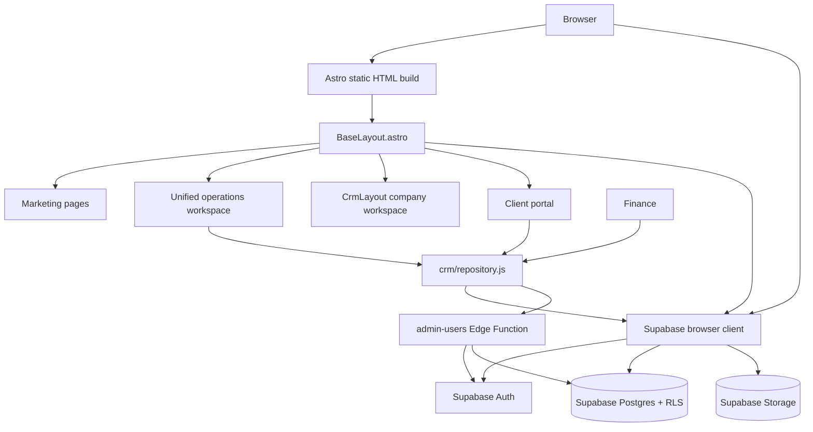
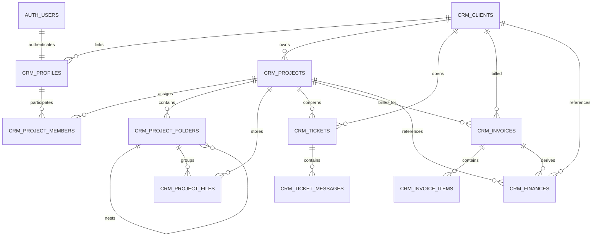

# TechMigos Website — Codebase Reference

> **Audit date:** 2026-09-18
> **Repository:** `TechmigosWebsite`
> **Branch audited:** `main`
> **Purpose:** durable, source-grounded reference for future development in this repository.

This file is the application-specific reference to read before making changes. It describes the code that exists in the repository today, the runtime data flows, the final Supabase security model, and the known gaps that affect future work.

It is intentionally separate from [`knowledge_Astro.md`](knowledge_Astro.md). That file is a generic Astro v4 knowledge base and is not an accurate application map for this project, which currently declares Astro 7 in [`package.json`](package.json).

## How to use this document

Use the actual source files and the latest Supabase migration as the final authority if this document ever becomes stale. The practical precedence is:

1. Current source under `src/`, `public/`, `scripts/`, and `supabase/functions/`.
2. The final migration state under [`supabase/migrations/`](supabase/migrations/), especially the September 2026 RBAC migrations.
3. Automated tests under [`test/`](test/).
4. This document and older planning/audit documents.

Do not copy credentials, service-role keys, or production secrets into this file. Public Supabase URL/key names are documented only by variable name and purpose.

## Executive summary

TechMigos is an Astro website deployed as a static Vercel site. It combines:

- Public marketing and portfolio pages rendered by Astro.
- Public browser-side forms that write directly to Supabase tables under RLS.
- Supabase Auth for company and client login.
- A client portal at `/client`.
- Compatibility exports under `src/features/operations/`; the former operations shell and mock runtime are retired.
- A shared CRM layout/controller pair in [`src/layouts/CrmLayout.astro`](src/layouts/CrmLayout.astro) and [`src/scripts/crm-workspace.js`](src/scripts/crm-workspace.js), now used by every `/company` feature route.
- Supabase Storage for resumes, finance proofs, invoice assets, signatures, and project files.
- One Supabase Edge Function, `admin-users`, for privileged Auth/profile administration.

The application is mostly a static document shell with bundled browser JavaScript. Astro produces the HTML; the browser then initializes Supabase, authenticates the user, loads CRM records, and hydrates or replaces parts of the page.

The active tree has two deliberately tracked follow-ups:

- **Live role/browser verification requires disposable `CRM_*` credentials**, which are not stored in the repository.
- **The `blog` and `careers` collections currently have no source entries**, so Astro emits empty-collection warnings; the schema is defined in `src/content.config.ts` and the pages still build.

## System architecture



### Runtime boundaries

| Boundary | Responsibility | Important implementation |
|---|---|---|
| Astro build | Generates static pages, metadata, content-driven pages, and sitemap files | `output: 'static'` in [`astro.config.mjs`](astro.config.mjs) |
| Shared layout | SEO, fonts/preconnects, Supabase initialization, CRM repository bootstrap, site-wide motion | [`src/layouts/BaseLayout.astro`](src/layouts/BaseLayout.astro) |
| Public browser code | Marketing interactions and direct public form submissions | Inline scripts in page/component files |
| CRM browser code | Authenticated reads/writes, role-scoped rendering, project delivery, support, files, invoices, finance, reports, and client portal flows | [`src/scripts/crm-workspace.js`](src/scripts/crm-workspace.js), [`src/scripts/client-portal.js`](src/scripts/client-portal.js), [`src/lib/crm/routePolicy.js`](src/lib/crm/routePolicy.js), [`src/lib/crm/workspaceStore.js`](src/lib/crm/workspaceStore.js) |
| Shared repository | Normalizes the browser-side `/api/portal/...` contract into Supabase operations | [`src/lib/crm/repository.js`](src/lib/crm/repository.js) |
| Database | Durable authorization, relationships, constraints, ledger triggers, and RLS | [`supabase/migrations/`](supabase/migrations/) |
| Edge Function | Privileged Auth user creation/invitation/profile changes | [`supabase/functions/admin-users/index.ts`](supabase/functions/admin-users/index.ts) |

There are no Astro API route files under `src/pages/api/`. The `/api/portal/...` paths are an internal repository abstraction used by browser code; they are parsed by `createCrmRepository()` and are not HTTP endpoints served by Astro.

## Repository map

| Path | Role |
|---|---|
| `src/pages/` | Public, auth, client, company, and sitemap routes |
| `src/layouts/BaseLayout.astro` | Shared public/CRM document layout and global browser bootstrap |
| `src/layouts/CrmLayout.astro` | Thin CRM layout/navigation/modal shell and page slot |
| `src/scripts/crm-workspace.js` | Bundled CRM browser controller, live state hydration, delegated actions, and compatibility adapters |
| `src/scripts/client-portal.js` | Bundled client portal controller using the shared repository and workspace store |
| `src/features/operations/` | Compatibility components and navigation exports; active workspace behavior is owned by the CRM runtime |
| `src/lib/crm/features/people.js` | Client and employee management renderers, assignment selectors, and relationship-aware detail views |
| `src/lib/crm/features/filesRuntime.js` | Private project-drive navigation, selection, signed file access/deletion, uploads, folder actions, and project-team assignment runtime |
| `src/lib/crm/features/invoiceBuilderRuntime.js` | Invoice builder state, persistence, asset/signature workflows, and scoped click actions |
| `src/lib/crm/features/supportRuntime.js` | Ticket detail selection and support view switching actions |
| `src/lib/crm/features/settingsRuntime.js` | Administrator company/invoice settings persistence runtime |
| `src/lib/crm/features/financeProofRuntime.js` | Private finance-proof uploads, signed previews, and proof actions |
| `src/lib/crm/features/reportExportRuntime.js` | Role-scoped report refresh/export/print actions and CSV, PDF, and finance export delivery |
| `src/lib/crm/features/workspaceUtils.js` | Pure workspace payload validation/coercion, profile identity helpers, filtering, and relationship lookups shared by the browser controller |
| `src/components/` | Shared navigation, footer, service, portfolio-focus, and CRM chrome components |
| `src/lib/crm/repository.js` | Supabase repository and internal portal request router |
| `src/lib/crm/permissions.js` | Client-side role/resource guard |
| `src/lib/crm/routePolicy.js` | Canonical company route and role policy |
| `src/lib/crm/workspaceStore.js` | Shared authenticated workspace state and selectors |
| `src/lib/crm/finance.js` | Finance/invoice calculation and classification helpers |
| `src/lib/crm/invoice.js` | Shared invoice branding and payment-link helpers |
| `src/lib/crm/invoiceHtml.js` | Canonical escaped printable invoice renderer shared by company and client portals |
| `src/lib/crm/popup.js` | Shared safe print-preview document replacement for CRM and client exports |
| `src/lib/siteContent.ts` | File-backed portfolio/client/testimonial content loader and sanitizer |
| `src/db/supabase.js` | Separate module-level Supabase client export |
| `src/scripts/crm-pdf.js` | jsPDF report generation/download helper |
| `src/styles/global.css` | Global marketing/base styles and design tokens |
| `src/styles/operations.css` | Shared CRM/Finance shell styles, navigation parity, responsive layout, and project-drive UI |
| `supabase/migrations/` | Schema, RLS, storage, triggers, and RPC history |
| `supabase/functions/admin-users/` | Server-side privileged user administration |
| `data/site-content.json` | Mutable file-backed site content used at build/runtime |
| `data/leads.json` | Present data artifact; current public contact flow writes to Supabase instead |
| `test/crm-rbac-finance.test.js` | Node tests for permissions, repository behavior, finance, and PDF export |
| `test/e2e/portal.spec.js` | Playwright login, recovery, keyboard, responsive, route, access, and live-role assertions |
| `scripts/playwright-static-server.mjs` | Serves the built static site in the foreground for the Playwright web-server contract |
| `scripts/validate-site.mjs` | Post-build required-file, forbidden-reference, SEO, and single-main-landmark validation |

## Technology and configuration

### Package stack

Declared in [`package.json`](package.json):

- Astro `^7.3.2`, static output.
- `@supabase/supabase-js` `2.116.0`.
- Tailwind CSS `3.4.19`, PostCSS, Autoprefixer.
- Canonical local CRM icon components under `src/components/crm/`; unused `astro-icon` and `lucide-react` packages were removed.
- Sharp `^0.35.4` for Astro image service.
- jsPDF and jsPDF AutoTable for CRM report PDFs.
- Playwright `^1.63.0` for E2E tests.
- TypeScript with Astro strict configuration.
- `@vercel/speed-insights` in the shared layout.

### Commands

| Command | Purpose |
|---|---|
| `npm run dev` | Astro development server |
| `npm run build` | Static production build |
| `npm run preview` / `npm start` | Serve the built `dist/` directory |
| `npm test` | Runs `node --test test/*.test.js` |
| `npm run test:e2e` | Runs Playwright tests in `test/e2e/`, skipping credential-gated live identities when credentials are absent |
| `npm run test:e2e:live` | Runs the same suite as a required live gate and fails clearly if any `CRM_*` identity is missing |
| `npm run crm:prepare-live` | Explicitly provisions disposable employee/client identities through the active CRM administrator and prints shell exports for the live gate; use `eval "$(npm run crm:prepare-live --silent)"` only in a disposable verification session |
| `npm run validate` | Runs `npm run build` then `scripts/validate-site.mjs` |
| `npm run security:audit` | Runs the npm registry audit at low severity |
| `npm run leads:list` | Lists leads using `scripts/lead-management.mjs` |
| `npm run leads:export` | Exports leads using `scripts/lead-management.mjs` |
| `npm run portal:user` | Provisions or updates a disposable CRM role identity through Supabase Auth/PostgREST; requires `SUPABASE_SERVICE_ROLE_KEY` and never stores credentials in the repository |
| `npm run release:github` | Executes the release shell script |
| `npm run vercel:link` / `vercel:pull` / `vercel:env:pull` | Vercel project/env helpers |

Dependencies are reproducible from the lockfile and all direct package specifications are exact-pinned. On 2026-09-18, `npm ci`, `npm test`, `npm run build`, `npm run validate`, TypeScript, npm audit, and the available Playwright browser gates completed successfully; the remaining build warnings are the empty `blog` and `careers` collections.

### Astro and Vite configuration

[`astro.config.mjs`](astro.config.mjs) defines:

- `output: 'static'`.
- Site URL from `PUBLIC_SITE_URL`, defaulting to `https://www.techmigos.com`.
- Sharp image service.
- Remote image domains `images.unsplash.com` and `picsum.photos`.
- No third-party icon package is required by the active shell; CRM icons are rendered by the canonical local component registry.

[`tsconfig.json`](tsconfig.json) extends Astro strict config and defines `@/*` as an alias for `./src/*`. Most existing imports use relative paths instead of the alias.

[`tailwind.config.cjs`](tailwind.config.cjs) scans `src/**/*.{astro,html,js,jsx,md,mdx,svelte,ts,tsx,vue}`. It defines Inter, Syne, and monospace families; primary indigo, accent cyan, and gold colors; motion keyframes; glow shadows; and utility classes such as `.perspective`, `.preserve-3d`, `.line-clamp-2`, `.text-balance`, and `.content-auto`.

### Environment variables

Names are listed in [`env.example.json`](env.example.json). Use `.env.local` for local secrets/configuration and never hardcode values in source.

| Variable | Classification | Use |
|---|---|---|
| `PUBLIC_SITE_URL` | Public | Astro canonical/site URL |
| `PUBLIC_API_BASE_URL` | Public/config | Optional legacy API base; currently the shared browser API fallback is empty |
| `PUBLIC_SUPABASE_URL` | Public | Supabase project URL |
| `PUBLIC_SUPABASE_KEY` | Public/publishable | Browser Supabase key; still keep it in environment configuration |
| `SITE_URL` | Edge Function config | Optional public origin used for invitation links; defaults to `https://www.techmigos.com` |
| `CSRF_SECRET` | Secret | Intended server-side CSRF HMAC secret; no current Astro API route consumes it |
| `ALLOWED_ORIGINS` | Server/config | Intended origin allowlist |
| `LEAD_NOTIFICATION_EMAIL` | Server/config | Intended lead notification target |
| `MSG91_AUTH_KEY` | Secret | Intended MSG91 provider authentication |
| `MSG91_EMAIL_DOMAIN`, `MSG91_EMAIL_FROM`, `MSG91_EMAIL_TO_NAME` | Server/config | Intended email sender configuration |
| `MSG91_*_TEMPLATE_ID` | Server/config | Intended notification template IDs |
| `CAREER_UPLOAD_DIR` | Server/config | Optional filesystem directory for the unused `careerUploads.ts` helper |
| `SITE_CONTENT_PATH` | Server/build config | Overrides `data/site-content.json` path |
| `FEATURED_PROJECT_ORDER` | Not currently read | `siteContent.ts` has a hard-coded featured order map instead |

`SUPABASE_SERVICE_ROLE_KEY` is required by the deployed Edge Function runtime but is not a browser variable and is intentionally not listed as a client-side configuration value. Never expose it in `vercel.json`, `.env.local` delivered to the browser, or Markdown documentation.

### Vercel behavior

[`vercel.json`](vercel.json):

- Builds with `npm run build:vercel` and serves `dist`.
- Sets the public site/Supabase variables needed by the static build.
- Redirects `techmigos.com` to `https://www.techmigos.com/:path*`.
- Adds `X-Content-Type-Options: nosniff`, `X-Frame-Options: SAMEORIGIN`, strict-origin referrer policy, and a Permissions Policy disabling camera, microphone, and geolocation.
- Gives `/_astro/*` and `/images/*` immutable one-year caching.

`.env*` files are ignored by the repository, with `.env.example` explicitly allowed for source control. Local credentials remain outside tracked source.

## Route inventory

All routes below are represented by current files unless marked otherwise. Astro static output means these are generated at build time; auth and data authorization happen in the browser/Backend after load.

### Public website

| URL | Source | Layout/data | Behavior |
|---|---|---|---|
| `/` | `src/pages/index.astro` | `BaseLayout`, `loadSiteContent()` | Home hero, services, stats, featured work, process, CTA; testimonials are currently disabled with `showTestimonials = false` |
| `/about` | `src/pages/about.astro` | `BaseLayout` | Static company story, milestones, values, technology section |
| `/services` | `src/pages/services.astro` | `BaseLayout` | Static service catalogue, FAQ, contact links; service IDs become contact query parameters |
| `/portfolio` | `src/pages/portfolio/index.astro` | `BaseLayout`, `loadSiteContent()` | Filters project cards by category in browser |
| `/portfolio/[slug]` | `src/pages/portfolio/[slug].astro` | `BaseLayout`, `getStaticPaths`, `loadSiteContent()` | Generated case-study detail pages |
| `/portfolio/focus-today` | `src/pages/portfolio/focus-today.astro` | Focus portfolio components | Curated product showcase |
| `/portfolio/focusflow` | `src/pages/portfolio/focusflow.astro` | Focus portfolio components | Curated product showcase |
| `/portfolio/hastkala` | `src/pages/portfolio/hastkala.astro` | Focus portfolio components | Curated product showcase |
| `/portfolio/notiva` | `src/pages/portfolio/notiva.astro` | Focus portfolio components | Curated product showcase |
| `/portfolio/spendscanr` | `src/pages/portfolio/spendscanr.astro` | Focus portfolio components | Curated product showcase |
| `/portfolio/techmigos-hub` | `src/pages/portfolio/techmigos-hub.astro` | Focus portfolio components | Curated product showcase |
| `/blog` | `src/pages/blog/index.astro` | `astro:content` collection `blog` | Filters non-draft posts, featured post, recent posts, categories, client-side search |
| `/blog/[slug]` | `src/pages/blog/[slug].astro` | `astro:content`, Markdown `render()` | Article detail, tags/category related-post calculation, article JSON-LD |
| `/careers` | `src/pages/careers/index.astro` | `astro:content` collection `careers` | Non-draft job listing, department/perk UI |
| `/careers/[slug]` | `src/pages/careers/[slug].astro` | `astro:content`, raw Markdown read | Job detail, parsed table of contents, application form, resume upload |
| `/contact` | `src/pages/contact.astro` | `BaseLayout`, direct Supabase insert | Public lead form writing to `contact_leads` |
| `/support` | `src/pages/support.astro` | `BaseLayout`, direct Supabase insert | Public support request converted to a `contact_leads` row |
| `/privacy` | `src/pages/privacy.astro` | `BaseLayout` | Static legal page |
| `/terms` | `src/pages/terms.astro` | `BaseLayout` | Static legal page |

### Authentication and portals

| URL | Source | Access/rendering |
|---|---|---|
| `/login` | `src/pages/login.astro` | Public login UI; browser Supabase Auth; compact glass login panel; routes clients to `/client` and company users to `/company` |
| `/reset-password` | `src/pages/reset-password.astro` | Public email recovery request using `auth.resetPasswordForEmail()` |
| `/change-password` | `src/pages/change-password.astro` | Authenticated first-login flow through `admin-users`, or standard Supabase Auth recovery/password update |
| `/client` | `src/pages/client.astro` | Client-only portal; repository-scoped projects, invoices, tickets, and external messages |

### Company/operations routes in the current source

| URL | Source | Shell | Current implementation |
|---|---|---|---|
| `/company` | `src/pages/company/index.astro` | `CrmLayout` | Role-aware live dashboard whose projects, KPI values, ticket summary, activity feed, and project navigation hydrate from the authenticated CRM repository |
| `/company/projects` | `src/pages/company/projects/index.astro` | `CrmLayout` | Live project management table/detail surface with shared shell, repository-backed CRUD, filters, and assignment actions |
| `/company/files` | `src/pages/company/files/index.astro` | `CrmLayout` | Live project drive: project picker → folders → folder files, grid/list views, signed previews, uploads, downloads, sharing, and admin deletion |
| `/company/support` | `src/pages/company/support/index.astro` | `CrmLayout` | Live support ticket list/conversation surface with shared shell and repository-backed ticket/message actions |
| `/company/finance` | `src/pages/company/finance.astro` | `CrmLayout` | Live Finance/CRM workspace with the same grouped company sidebar as every other company route; Finance remains the active item |
| `/company/analytics` | `src/pages/company/analytics.astro` | `CrmLayout` | Live analytics renderer with shared shell, access guard, and repository data context |
| `/company/reports` | `src/pages/company/reports.astro` | `CrmLayout` | Live reports renderer with shared shell, filters, export flow, and repository data context |
| `/company/users` | `src/pages/company/users/index.astro` | `CrmLayout` | Admin user-management surface with shared shell and privileged repository/Edge Function operations |
| `/company/settings` | `src/pages/company/settings/index.astro` | `CrmLayout` | Admin settings surface with company/invoice settings persistence through the repository |

### Sitemap routes

| URL | Source | Behavior |
|---|---|---|
| `/sitemap.xml` | `src/pages/sitemap.xml.ts` | Prerendered XML built from static paths, non-draft blog/career entries, and `siteContent.projects` |
| `/sitemap-index.xml` | `src/pages/sitemap-index.xml.ts` | Prerendered sitemap index pointing at `/sitemap.xml` |

### Route status and source/test mismatch

The active E2E policy now treats all nine company routes as supported static documents and verifies that unauthenticated access redirects to login. Live role tests land administrators and assigned employees in `/company`, while clients land in `/client`. The company route and role matrix is centralized in [`src/lib/crm/routePolicy.js`](src/lib/crm/routePolicy.js).

## Shared layout and browser bootstrap

### `BaseLayout.astro`

[`BaseLayout.astro`](src/layouts/BaseLayout.astro) is used by marketing pages, auth pages, the client portal, and the authenticated CRM workspace.

Props:

- `title` required.
- `description`, `ogImage`, `ogType`.
- `noIndex` for auth/portal pages.
- `hideNavbar`, `hideFooter`.
- `isCrm`, which suppresses the public custom cursor/progress bar and footer behavior.
- `requiresCrmRuntime`, which loads the repository/Chart runtime only for the company workspace and client portal; public/auth pages receive the lightweight auth runtime.

Head behavior:

- Generates page title, description, robots, canonical, Open Graph, and Twitter tags.
- Uses `PUBLIC_SITE_URL`/Astro site with `https://www.techmigos.com` fallback.
- Emits Organization, WebSite, WebPage, and optional BreadcrumbList JSON-LD.
- Preconnects Google Fonts and the Supabase project.
- Loads the lockfile-managed Supabase/Chart browser modules through Astro/Vite; no CRM runtime is emitted for public/auth pages.

Browser globals initialized by the inline bootstrap:

| Global | Meaning |
|---|---|
| `window.tmSupabase` | Browser Supabase client, or `null` if public variables are absent/initialization fails |
| `window.tmCrmReady` | Promise resolved once `createCrmRepository(() => window.tmSupabase)` is exposed on CRM pages |
| `window.tmCrm` | `{ repository }` object on CRM pages |
| `window.__resolveTmCrm` | Internal CRM promise resolver |

The shared browser script also implements custom cursor behavior, scroll progress, IntersectionObserver reveal classes, magnetic buttons, number counters, and tilt cards. Enhanced effects are disabled for reduced motion and generally for non-fine pointers.

### `CrmLayout.astro` and `crm-workspace.js`

[`CrmLayout.astro`](src/layouts/CrmLayout.astro) is now a 73-line compatibility shell. Its browser controller is [`crm-workspace.js`](src/scripts/crm-workspace.js), which contains the remaining orchestration and compatibility adapters:

- More than 4,000 lines of CRM-specific styles and responsive behavior remain centralized in `src/styles/operations.css` and `src/styles/crm-shell.css`.
- CRM shell markup and page slot.
- Bundled controller state, data loading, compatibility adapters, event delegation, uploads, and remaining orchestration; the single-root event contract (action selector, CRM-surface scoping, listener registration, and disposal) lives in `src/lib/crm/features/delegatedEvents.js`, while delegated form mutations live in `src/lib/crm/features/formEvents.js`; shared session, permission, and finance selectors live in `src/lib/crm/features/workspaceContext.js`; invoice preview/print/detail behavior lives in `src/lib/crm/features/invoicePreviewRuntime.js`; Finance ledger validation, row persistence, and inline autosave live in `src/lib/crm/features/financeLedgerRuntime.js`; relationship-aware form construction, authenticated modal workflow, administrative overlays, and generic record actions live in `src/lib/crm/features/operationsForms.js`, `src/lib/crm/features/operationsWorkflow.js`, `src/lib/crm/features/operationsOverlays.js`, and `src/lib/crm/features/recordActions.js`, pure workspace validation/coercion and relationship helpers live in `src/lib/crm/features/workspaceUtils.js`, while route renderers and report delivery live under `src/lib/crm/features/`.
- A `window.tmCrmPdf` bridge to [`src/scripts/crm-pdf.js`](src/scripts/crm-pdf.js).

All active company feature pages render this layout with a route-specific `activeTab`: dashboard, projects, files, tickets/support, finance, analytics, reports, users, and settings. The page wrappers are intentionally thin; the shell and bundled controller own the shared sidebar/topbar, auth/session guard, data loading, renderer selection, interaction binding, modals, and repository writes.

The shared header includes search, notifications, help, profile management, and a visible sign-out control. Sign-out clears CRM/session caches, calls Supabase Auth sign-out, and redirects to `/login`. The shared sidebar uses the canonical grouped navigation adapter and persists collapse state in `localStorage` under `tm_crm_sidebar_collapsed`.

Header and rail dimensions are intentionally locked in the final shell section of [`src/styles/operations.css`](src/styles/operations.css). The authoritative desktop contract is a 264px sidebar, 66px topbar, 470px search field, 36px action/logout controls, 36px avatar, 40px brand mark, and 36px navigation rows for both `operations-page` and `finance-page`. At mobile widths the same two shells use a 56px rail and the same responsive topbar grid; this prevents dashboard-specific sizing from shifting the header between routes.

The `/company/files` renderer is the active project-drive implementation. It starts at a project picker, enters one selected project, exposes its folders in the left drive rail, enters one folder, and then renders that folder’s live files in grid or list mode. Selecting a file keeps the file list visible and fills the right detail panel. Image and PDF previews use a short-lived Supabase Storage signed URL; unsupported MIME types retain open/download actions. Uploads are sent to the private `project-files` bucket and persist metadata in `crm_project_files`.

The Files visual language intentionally borrows the supplied reference without replacing the TechMigos theme: folder categories receive deterministic blue/orange/green/purple/red/brown tones from their names, and file cards receive MIME/extension tones for images, PDFs, design files, archives, spreadsheets, presentations, documents, video, and generic files. Grid mode uses a compact thumbnail-like icon block with a selected check marker; list mode remains a dense horizontal browser. These are presentation classes derived in `renderFilesReference()` and should stay data-independent so live uploads immediately inherit the same treatment.

### Retired legacy operations shell

The former `AppShell.astro`, `operations-app.js`, mock adapters, and legacy operations stylesheet were unreachable from active routes and have been removed. Their visual preview assets remain under `public/techmigos-ops/assets/` for reference; authenticated data must flow through the CRM shell/controller, repository, and shared workspace store.

The active CRM shell:

- Wraps the page in `BaseLayout` with `noIndex`, hidden public navbar, and `isCrm`.
- Uses the canonical grouped sidebar and shared CRM chrome components.
- Uses `window.tmCrmReady` and `createCrmRepository()` for live authentication and data hydration.
- Applies the canonical route policy for admin and assigned employee navigation.
- Persists only non-sensitive shell preferences in `localStorage`; Supabase remains authoritative for business data.
- Provides top-bar notifications, profile/account management, password reset, sign-out, and responsive keyboard-accessible controls.

The database RLS policies remain the authority. Browser route and resource guards are UX/access pre-checks and must not be treated as a security boundary.

## Public data and content systems

### File-backed site content

[`src/lib/siteContent.ts`](src/lib/siteContent.ts) owns the build-time/file-backed marketing content model:

```ts
type SiteContent = {
  clientNames: string[];
  testimonials: Testimonial[];
  projects: Project[];
};
```

`Project` includes `slug`, `title`, `category`, `emoji`, `tags`, `image`, `description`, `result`, `overview`, `challenge`, `solution`, `results[]`, `timeline`, `team`, `services`, and optional `featured`/`href`.

Behavior:

- Reads `SITE_CONTENT_PATH` or `data/site-content.json`.
- Creates the file with defaults if absent.
- Sanitizes all strings/arrays and discards incomplete project/testimonial rows.
- Falls back to built-in defaults when client names, testimonials, or projects are empty.
- Sorts projects with the hard-coded featured order `focus-today`, then `focusflow`; all other equal-priority items retain their input order.
- `validateSiteContentPayload()` returns `{ ok, fieldErrors }` for required fields.
- `saveSiteContent()` sanitizes then writes JSON.

The data file is used by the home and portfolio pages. The public project detail route is statically generated from the sanitized project list.

### Content collections

Blog, careers, and sitemap code imports `astro:content`:

- `src/pages/blog/index.astro` calls `getCollection('blog')`.
- `src/pages/blog/[slug].astro` calls `getCollection('blog')` and `render()`.
- `src/pages/careers/index.astro` calls `getCollection('careers')`.
- `src/pages/careers/[slug].astro` calls `getCollection('careers')` and reads `src/content/careers/${job.id}.md` directly.
- `src/pages/sitemap.xml.ts` calls both collections.

The collection schemas are defined in `src/content.config.ts`. The current repository has no blog or career source entries, so Astro emits empty-collection warnings while still producing the public pages. The careers detail page also performs a defensive direct raw-file read for the source Markdown body.

### Public forms

Public form writes happen directly from the browser through `window.tmSupabase`:

| UI | Table | Payload behavior |
|---|---|---|
| Contact form | `contact_leads` | Writes name, email, company, service, budget, message, `source_path: '/contact'`. The phone field is displayed but is not included in the current payload. |
| Support form | `contact_leads` | Converts topic/priority/company/product/subject/details into `service`, `budget`, and a combined message with `source_path: '/support'`. |
| Footer newsletter | `newsletter_subscribers` | Writes email and current `source_path`. |
| Career application | `career_applications` | Uploads optional resume to private `resumes`, then inserts job/contact/links/cover letter/path metadata. Removes the uploaded object if the row insert fails. |

All public forms include a honeypot field named `company_website`; a filled honeypot returns a success-like result without writing. Forms call the shared CSRF helper, but the current code does not send a CSRF header and the helper returns a placeholder token. See [Security and implementation gaps](#security-and-implementation-gaps).

## Authentication and portal flows

### Login

[`src/pages/login.astro`](src/pages/login.astro) is prerendered and contains the split login UI with four rotating visual slides.

Flow:

1. User enters a username or email and password.
2. For email sign-in, the browser calls `supabase.auth.signInWithPassword()` directly. For usernames, it calls the `username-login` Edge Function; that server-side function resolves the email using its service-role client, verifies the password through Supabase Auth, and returns only the resulting session tokens.
3. The browser installs the returned username-login session with `supabase.auth.setSession()`; it never receives the resolved email from the username lookup.
4. It reads the authenticated user’s active `crm_profiles` row.
5. It records last login through `record_crm_last_login`.
6. If `must_change_password` is true, redirect to `/change-password`.
7. Otherwise, redirect clients to `/client`; company roles to `/company`.

The current database role values are `company_admin`, `company_member`, and `client`. The E2E test labels the middle role “Employee” and uses `CRM_EMPLOYEE_*` environment variables, but the stored role is `company_member`.

The new `username-login` function is deployed with JWT verification disabled because it is a pre-authentication endpoint; it performs password verification itself and has an explicit CORS origin allowlist. The hosted anonymous username resolver grant remains until the updated website is deployed, to avoid breaking username sign-in on the currently served frontend.

### Password reset/change

- `/reset-password` sends a Supabase Auth recovery email with a redirect to `/change-password`.
- `/change-password` loads the authenticated profile first. Provisioned users with `must_change_password` use the `admin-users` Edge Function; normal recovery sessions use `auth.updateUser({ password })`, so the reset-email workflow reaches a working password update.

### Client portal

[`src/pages/client.astro`](src/pages/client.astro) is a no-index client workspace. It loads the repository, confirms the active role, and calls:

- `/api/portal/client/overview` for the linked client, projects, invoices, and tickets.
- `/api/portal/client/invoices/:id` for invoice detail.
- `/api/portal/client/tickets/:id/messages` for external conversation.
- `/api/portal/client/tickets` to create a ticket linked to one of the client’s projects or general support.
- `/api/portal/client/tickets/:id/messages` to reply externally.

The UI renders project progress/health, invoice balances, tickets, invoice print preview, and an A4 landscape print/PDF flow. The repository selects and trims client-safe project, ticket, invoice, and client fields before returning them, and employee project responses exclude budget, expense, revenue, and internal identifier fields; the employee mutation RPCs also return an operational JSON shape instead of a full table row. It does not grant client access; RLS and repository permissions do that.

## CRM user interface

The former operations shell, mock adapters, and public operations script have been retired. Their preview assets remain for visual reference only. Active company pages use the shared CRM shell, canonical route policy, repository, workspace store, and reusable CRM components.
- `/company` dashboard hydration from repository-scoped projects plus admin tickets, profiles, finances, and activities; dashboard project rows open the selected project workspace.
- Dashboard shell interactions: desktop sidebar persistence/collapse, mobile menu/backdrop, top-bar popovers, live notification badge, profile menu, and Supabase sign-out.
- Settings toggles and CSV export.
- Live project/user/ticket/file/stat hydration through the repository.

Some filtering/pagination/action behavior remains local UI behavior rather than server-side querying.

### New CRM/Finance implementation

`crm-workspace.js` contains the fuller live implementation. Its state includes active view, profile, settings, data arrays, selected rows, Finance filters/sheets/invoice builder, project/file folder state, ticket state, report dates, and row save status.

The CRM navigation adapter [`src/lib/crmNav.ts`](src/lib/crmNav.ts) derives the canonical grouped list from [`src/lib/crm/routePolicy.js`](src/lib/crm/routePolicy.js); [`src/features/operations/data/nav.ts`](src/features/operations/data/nav.ts) remains a compatibility re-export. Both company shells therefore expose the same route order, labels, icons, and resource metadata:

```ts
[
  { href: '/company', label: 'Dashboard', group: 'Work', resource: 'projects' },
  { href: '/company/projects', label: 'Projects', group: 'Work', resource: 'projects' },
  { href: '/company/files', label: 'Files', group: 'Work', resource: 'project_files' },
  { href: '/company/support', label: 'Support', group: 'Work', resource: 'tickets' },
  { href: '/company/finance', label: 'Finance', group: 'Insights', resource: 'finances' },
  { href: '/company/analytics', label: 'Analytics', group: 'Insights', resource: 'projects' },
  { href: '/company/reports', label: 'Reports', group: 'Insights', resource: 'projects' },
  { href: '/company/users', label: 'User Management', group: 'Admin', resource: 'profiles' },
  { href: '/company/settings', label: 'Settings', group: 'Admin', resource: 'settings' },
]
```

The CRM chrome components are:

- [`src/components/crm/Sidebar.astro`](src/components/crm/Sidebar.astro): grouped Work/Insights/Admin navigation rendered from the shared adapter, with active state, role/resource metadata, icons, and collapse control.
- [`src/components/crm/Topbar.astro`](src/components/crm/Topbar.astro): search, workspace/clock/status, notifications, help, identity, logout affordance.
- [`src/components/crm/OverlayLayer.astro`](src/components/crm/OverlayLayer.astro): modal, invoice print/export, toast, invoice hover preview, proof preview.
- [`src/components/crm/Icon.astro`](src/components/crm/Icon.astro), [`CrmButton.astro`](src/components/crm/CrmButton.astro), [`CrmIconButton.astro`](src/components/crm/CrmIconButton.astro), and [`CrmModal.astro`](src/components/crm/CrmModal.astro): canonical CRM UI primitives used by the active shell and legacy compatibility wrappers.

Important renderer families exposed by the shell and feature modules include dashboard, assigned-employee project view, project management, files/project drive, tickets, Finance, analytics, reports, clients, employees/users, settings, and generic CRUD. Remaining shell helpers are compatibility adapters and should be extracted only as cohesive units.

## CRM repository contract

[`src/lib/crm/repository.js`](src/lib/crm/repository.js) is the central client-side data layer. It is created once in `BaseLayout` and consumed through `window.tmCrm.repository`.

### Context and authorization flow

`getContext(force = false)`:

1. Obtains the current Supabase Auth user.
2. Queries `crm_profiles` by `auth_user_id`.
3. Requires an active profile and a valid role.
4. Caches the context promise until forced/cleared.

`requireResource(resource, method)` checks the client-side permission map before table operations. Supabase RLS is the actual security boundary and must be updated in migrations whenever a permission changes.

`requireProjectAccess()` enforces the same assigned-project boundary in the repository as the final database policy: non-admin company users must be assigned through an active project membership, while administrators bypass that check. RLS remains authoritative.

### Resource/table map

| Resource path segment | Supabase table |
|---|---|
| `profiles` | `crm_profiles` |
| `clients` | `crm_clients` |
| `projects` | `crm_projects` |
| `tickets` | `crm_tickets` |
| `ticket_messages` | `crm_ticket_messages` |
| `invoices` | `crm_invoices` |
| `invoice_items` | `crm_invoice_items` |
| `finances` | `crm_finances` |
| `activities` | `crm_activities` |
| `settings` | `crm_settings` |
| `project_members` | `crm_project_members` |
| `project_folders` | `crm_project_folders` |
| `project_files` | `crm_project_files` |

Legacy modules `leads`, `deals`, `followups`, and `campaigns` are intentionally disabled by final RLS and are not in the active `TABLE_MAP`.

### Internal `/api/portal` request paths

The repository parses these path families in `request()`:

| Path family | Behavior |
|---|---|
| `/api/portal/me` | Current profile/context |
| `/api/portal/client/overview` | Client-linked overview |
| `/api/portal/client/invoices/:id` | Client invoice detail |
| `/api/portal/client/tickets` | Client ticket creation/list behavior |
| `/api/portal/client/tickets/:id/messages` | Client external messages |
| `/api/portal/ticket_messages/:id` | Company ticket message read/write |
| `/api/portal/settings/:category` | Admin-only settings read/patch |
| `/api/portal/invoices/:id` | Invoice detail, update, delete paths; saves use RPC |
| `/api/portal/invoices/:id/upload-sign` | Admin invoice signature upload |
| `/api/portal/invoices/:id/proof` / related asset paths | Invoice asset/signature URL handling |
| `/api/portal/finances/:id/upload-proof` | Admin finance proof upload |
| `/api/portal/project_files/:id/download` | Signed project-file URL |
| `/api/portal/project_files/:id` | Admin delete path |
| `/api/portal/projects/:id` | Admin project deletion and generic project access |
| `/api/portal/profiles` | Admin Edge Function invite/provision |
| `/api/portal/profiles/:id` | Admin profile update via Edge Function |
| `/api/portal/:resource` | Generic GET/POST/PATCH/DELETE for enabled resources |

The repository sends multipart `FormData` for file operations and JSON for ordinary CRUD. Supabase errors are wrapped into readable `Error` messages.

Project-drive-specific methods in `repository.js` are the preferred active path for the company Files page:

- `uploadProjectFile(projectId, folderId, file)` validates project access and the 50 MiB limit, uploads to private Storage, then inserts `crm_project_files` metadata.
- `uploadProjectFolder(projectId, files, folderName)` creates a folder and uploads a batch into it.
- `getProjectFileUrl(id, { download })` checks project access and returns a 10-minute signed URL for preview or download.
- `deleteProjectFile(id)` removes the Storage object and metadata row for admins.

The active Files UI derives project/folder/file lists from `state.data.projects`, `state.data.project_folders`, and `state.data.project_files`. A selected folder filters files by `folder_id`; switching folders clears the selected file. A selected image/PDF asynchronously receives a signed URL and renders in the right detail panel. The browser does not expose Storage objects publicly.

### Input sanitization and limits

The repository uses resource field allowlists and converts numeric/boolean fields before writes.

- Project name is required on create and limited to 160 characters.
- Project status is one of `planning`, `active`, `review`, `completed`, `on_hold`, `cancelled`.
- Project health is one of `on_track`, `watch`, `at_risk`, `breached`.
- Project budget, expenses, and revenue cannot be negative.
- Client profiles must have a valid positive `client_id`.
- Folder names are trimmed and limited to 120 characters.
- Generic asset/proof files use a 10 MiB limit.
- Generic images are PNG/JPEG/WebP; finance proofs add PDF.
- Project files use a 50 MiB limit and an explicit PDF, office-document, spreadsheet, presentation, text, ZIP, PNG, JPEG, and WebP MIME allowlist in both the repository and private Storage/table policies.
- Support tickets require a client when created; a linked project must belong to that same client. General support tickets may remain unlinked to a project.
- Invoices use the same graph rule: an optional linked project must belong to the invoice client before the invoice RPC is called and at the database trigger boundary.
- Invoice line items require descriptions and nonnegative quantity/rate values.

## Final role and resource model

The canonical role strings are exported from [`src/lib/crm/permissions.js`](src/lib/crm/permissions.js):

- `company_admin`
- `company_member`
- `client`

The code calls `company_member` “Employee” in user-facing labels and tests.

### Effective behavior after the final migrations

| Capability/resource | Company Admin | Company Member / Employee | Client | Anonymous |
|---|---:|---:|---:|---:|
| Read all enabled CRM data | Yes | No | No | No |
| Read assigned projects | Yes | Yes, assigned projects only | Own linked projects | No |
| Read assigned project folders/files | Yes | Yes, assigned projects only | No | No |
| Create project folders/files | Yes | Yes, assigned projects only | No | No |
| Update/delete projects | Yes | Update assigned projects only; no delete | No | No |
| Read clients | Yes | No | Own linked client only | No |
| Read tickets/messages | Yes | Assigned tickets/messages only | Own linked tickets; external messages | No |
| Create tickets/external messages | Yes | Internal messages on assigned tickets only | Yes | No |
| Read invoices/items | Yes | No | Own linked invoices/items | No |
| Create/update/delete invoices | Yes | No | No | No |
| Read/write finances | Yes | No | No | No |
| Upload finance proofs | Yes | No | No | No |
| Read settings/profiles | Yes | No | No | No |
| Manage users | Yes | No | No | No |
| Use leads/deals/followups/campaigns | No; disabled | No; disabled | No | No |
| Public contact/newsletter/career submission | N/A | N/A | N/A | RLS-scoped inserts |

The client-side permission helpers implement the same high-level model: admin can operate on enabled resources, employees can read assigned project/support resources, update only assigned project/ticket delivery fields, create project folders/files and internal messages, and clients can read linked portal resources and create tickets/external messages. Employees cannot delete or reassign records.

An older [`CRM_RBAC_FEATURE_MATRIX.md`](CRM_RBAC_FEATURE_MATRIX.md) describes an earlier broader company-member model and should be treated as historical/supplementary, not as the final permission authority.

## Supabase schema and relationships

### Core tables

The initial schema is [`20260628062713_init_crm_schema.sql`](supabase/migrations/20260628062713_init_crm_schema.sql). Later migrations add columns, constraints, indexes, triggers, RPCs, and RLS.

| Table | Main purpose | Important links/fields |
|---|---|---|
| `crm_profiles` | Application profile for an Auth user | `auth_user_id`, unique `username`, `role`, `status`, optional `client_id`, `must_change_password`, `last_login` |
| `crm_clients` | Customer/company records | name, company, email, phone, status, marketing opt-in, notes |
| `crm_projects` | Delivery projects | optional `client_id`, `owner_user_id`, budget/expenses/revenue, status/health/progress, due date |
| `crm_project_members` | Project assignment | project/profile pair, member role, assigned_by |
| `crm_project_folders` | Project Drive folders | project, optional parent, name, creator |
| `crm_project_files` | Project Drive metadata | project/folder, object path, original name, MIME, size, uploader |
| `crm_tickets` | Support tickets | optional client/project, priority/status, assignment |
| `crm_ticket_messages` | Ticket conversation | ticket, body, author, visibility `internal`/`external` |
| `crm_invoices` | Customer invoices | client/project, invoice number, dates, totals, received/status, snapshots/branding, sign URL |
| `crm_invoice_items` | Invoice line items | invoice, description, quantity, rate, amount, sort order |
| `crm_finances` | Cash/expense/invoice ledger rows | type, status, amount, invoice/client/project references, proof URL |
| `crm_settings` | JSON settings | category `company` or `invoice`, JSON data |
| `crm_activities` | Activity records | actor/activity metadata |
| `crm_leads` | Legacy lead table | disabled in final policy |
| `crm_deals` | Legacy deal table | disabled in final policy |
| `crm_followups` | Legacy follow-up table | disabled in final policy |
| `crm_campaigns` | Legacy campaign table | disabled in final policy |
| `contact_leads` | Public website contact/support submissions | name/email/company/service/budget/message/source |
| `newsletter_subscribers` | Public newsletter subscriptions | email/source/timestamps |
| `career_applications` | Public job applications | job/contact/links/cover letter/resume metadata |
| `todos` | Initial schema utility table | Not part of the active repository map |

### Relationship diagram



### Integrity rules added late in the migration history

- A client profile must reference an existing client; non-client profiles must have `client_id = NULL`.
- Project/client links are checked and project display `client_name` is synchronized from the linked client.
- Finance client/project links are checked for consistency and display fields are synchronized.
- Invoice client/project combinations are checked for consistency.
- Project files cannot reference a folder from another project.
- Folder names are constrained; employees can create folders on assigned projects, while folder rename and deletion remain administrator-only under the final policy.
- Active-profile helper functions ignore pending/inactive users.

## Migration and RLS timeline

Apply migrations in filename order. The later migrations supersede earlier broad policies.

| Migration | Contribution |
|---|---|
| `20260628062713_init_crm_schema.sql` | Creates CRM/public tables, helper functions, initial RLS, settings, buckets, indexes, triggers, invoice numbering |
| `20260628070000_username_lookup_rpc.sql` | Adds username/email lookup RPC; later replaced to use `username` |
| `20260709000000_add_invoice_recurring.sql` | Adds recurring invoice flag |
| `20260712090000_secure_public_resume_uploads.sql` | Restricts anonymous resume uploads to `applications/...`, PDF/DOC/DOCX, 5 MiB |
| `20260712091500_crm_role_visibility.sql` | Early role visibility rules; superseded by later RBAC hardening |
| `20260803120000_crm_admin_settings_rbac.sql` | Makes settings admin-only |
| `20260804000000_add_invoice_project_snapshot_branding.sql` | Adds invoice project snapshot/branding |
| `20260904090000_crm_rbac_finance_hardening.sql` | Main RBAC hardening, active/admin helpers, final broad employee-read policy before project-only scope, invoice RPC, finance proof/signature policy |
| `20260906100000_crm_active_profile_security.sql` | Makes helper functions consider only active profiles |
| `20260906110000_crm_disable_legacy_modules.sql` | Makes leads/deals/followups/campaigns admin-only/disabled; tightens RPC grants |
| `20260906120000_finance_invoice_ledger_entries.sql` | Adds invoice reference and allows invoice ledger type |
| `20260906130000_sync_invoice_income_ledger.sql` | Generates/upserts a derived invoice ledger row |
| `20260906140000_cleanup_invoice_income_ledger.sql` | Cleans derived row on invoice delete |
| `20260906150000_align_invoice_ledger_status.sql` | Aligns derived ledger status to invoice payment state |
| `20260908090000_core_crm_project_drive.sql` | Adds usernames, project assignments, folders/files, storage helpers, project file bucket and RPCs |
| `20260909090000_project_folder_rename_and_integrity.sql` | Adds folder/file integrity and owner folder rename |
| `20260909110000_project_crm_link_integrity.sql` | Adds finance links and project/client/invoice consistency triggers |
| `20260915100000_employee_project_only_scope.sql` | Removes broad employee company reads and employee update RPC access |
| `20260915110000_allow_all_project_file_types.sql` | Makes project-files bucket accept all MIME types up to 50 MiB |
| `20260915120000_client_project_portal_link.sql` | Adds/validates client profile-to-client link |
| `20260915130000_employee_assigned_project_files.sql` | Restores employee read/create only for assigned project objects; finalizes storage read/manage split |
| `20260919100000_minimize_employee_rpc_responses.sql` | Prevents employee project/ticket mutation RPCs from returning full rows containing restricted fields |

### Final RLS interpretation

- Admin policies cover all enabled CRM resources.
- Employee/company-member policies are assignment-scoped to `crm_projects`, `crm_project_members`, `crm_project_folders`, and `crm_project_files`.
- Employee storage reads require admin or active membership in the file’s project; storage object management remains admin-only.
- Client policies scope CRM reads to the active profile’s linked `client_id` and allow ticket/external-message creation.
- Profiles/settings are admin-only except the normal authenticated context lookup needed by the application.
- Legacy modules remain disabled for ordinary use.

RLS policy changes must be made in a new migration, not by editing an old migration after it has been applied remotely.

## Storage

| Bucket | Visibility | Intended objects | Limits/policies |
|---|---|---|---|
| `resumes` | Private | Career application resumes | Anonymous insert only under `applications/...`; PDF/DOC/DOCX; 5 MiB; staff read |
| `invoice-signatures` | Private | Invoice signatures and invoice branding assets | Admin upload/update; linked clients receive short-lived signed URLs |
| `finance-proofs` | Private | Finance receipt/proof image or PDF | Admin write; staff read/signed URLs; repository limit 10 MiB |
| `invoice-signatures` (`invoice-assets/*` path namespace) | Private | Invoice signatures and company/invoice branding assets | Admin-only writes; repository stores object paths and resolves linked client reads through short-lived signed URLs |
| `project-files` | Private | Project files/folders | 50 MiB; PDF, office, text/CSV/JSON, ZIP, PNG, JPEG, and WebP MIME allowlist; admin manages; assigned employees read/create metadata/upload on assigned projects |

Repository storage conventions:

- Finance proofs: `records/<financeId>/<timestamp>-<safeName>`.
- Project files: `projects/<projectId>/<timestamp>-<sequence>-<safeName>`.
- Project folder uploads: files are uploaded sequentially and metadata is inserted into `crm_project_files`.
- Signed URLs generally expire after 600 seconds.
- Invoice/finance upload cleanup attempts to remove an uploaded object when the following database operation fails.

## Finance and invoice behavior

### Shared finance helpers

[`src/lib/crm/finance.js`](src/lib/crm/finance.js) defines:

- Invoice settled statuses: `paid`, `completed`.
- Finance types: `income`, `revenue`, `expense`, `salary`, `invoice`.
- Income types: `income`, `revenue`, `invoice`.
- Cash income types: `income`, `revenue` only.
- Expense types: `expense`, `salary`.
- Transaction statuses: `pending`, `paid`, `received`, `half_payment`, `cancelled`.

`invoiceTotal()` reads `total_amount` or `amount` and clamps to nonnegative. `invoiceReceived()` treats settled invoices as fully received, otherwise clamps the received amount between zero and total. `invoiceBalance()` returns zero for cancelled invoices and otherwise total minus received.

`calculateInvoiceTotals()`:

1. Normalizes line items.
2. Ignores blank descriptions.
3. Clamps quantity/rate to nonnegative values.
4. Calculates `subtotal - discount + tax`, never below zero.
5. Clamps received amount to the total.
6. Marks the invoice paid when received reaches total.

### Invoice ledger distinction

An `invoice` Finance row is a receivables/ledger entry, not cash income by itself. It counts as income only when its status is `received`/settled. Database triggers maintain one derived invoice ledger row per invoice; invoice status becomes `received` only when the invoice is paid, and cancelled invoices produce a cancelled derived row.

### Finance UI

The active Finance renderer, orchestrated by `crm-workspace.js` and backed by the shared finance selectors, provides:

- All/transactions/invoices/reports tabs.
- Finance record inline editing/autosave.
- Invoice creation/editing with line items, discount, tax, received amount, status, and notes.
- Invoice branding/settings.
- UPI payment information and QR generation using configured invoice/company settings and the TechMigos merchant label.
- Invoice previews and PDF/print behavior.
- Finance proof uploads and previews.
- Report filtering and export using `crm-pdf.js`.

`src/scripts/crm-pdf.js` creates landscape A4 PDFs with an internal TechMigos header, metrics, AutoTable rows, period, generated timestamp, and confidential footer.

## Edge Function: `admin-users`

[`supabase/functions/admin-users/index.ts`](supabase/functions/admin-users/index.ts) is the privileged Auth/profile boundary.

### Operations

- `invite`: Auth invite by email to `${SITE_URL}/change-password` (default `https://www.techmigos.com`), pending profile with a required first password change; the authenticated invitation session activates the profile after the password is set.
- `provision`: Creates confirmed user with initial password and `must_change_password: true`.
- `update_profile`: Updates Auth email/metadata and `crm_profiles`.
- `set_status`: Updates profile/Auth status behavior.
- `change_initial_password`: Authenticated user changes their own temporary password; this is the one non-admin operation.

### Validation/security behavior

- Normalizes email/username.
- Username format: lowercase, starts alphanumeric, 3–64 characters, allowed `[a-z0-9._-]`.
- Initial password requires at least eight characters, including lowercase, uppercase, digit, and symbol.
- Validates role/status and client linkage.
- `requireAdmin()` validates the bearer token with the anon client, then checks an active `company_admin` profile with the service client.
- Uses the service role only inside the Edge Function.
- Cleans up a newly-created Auth user when profile insertion fails.

The function uses an explicit `ALLOWED_ORIGINS` allowlist with the production site and local development origins as defaults; it never emits wildcard CORS.

## Components and reusable UI

### Shared public components

- [`Navbar.astro`](src/components/Navbar.astro): desktop/mobile links, active path, login and contact CTAs, mobile menu markup.
- [`Footer.astro`](src/components/Footer.astro): service/company/resource/legal links, social links, newsletter form, public contact CTA.
- [`ServiceIcon.astro`](src/components/ServiceIcon.astro): service icon rendering.

### Portfolio-focus components

Under [`src/components/portfolio/focus/`](src/components/portfolio/focus/):

- `BrowserFrame`
- `FeatureGrid`
- `FinalCta`
- `HeroSection`
- `PhoneFrame`
- `ScrollStoryDemo`
- `ShowcaseCarousel`
- `TrustCards`

These compose the curated product showcase pages. They are separate from the generic `siteContent` case-study route.

### Operations compatibility components

The remaining components under [`src/features/operations/components/`](src/features/operations/components/) are compatibility wrappers only. New authenticated workspace UI must use the canonical CRM components and the shared route/store contracts.

### CRM chrome

The CRM-only components are described in [New CRM/Finance implementation](#new-crmfinance-implementation). Keep `BaseLayout`’s `isCrm` behavior in mind when adding new CRM pages; it intentionally suppresses public navigation/footer and enhanced marketing effects.

## Styling and visual system

There are two active style layers:

1. [`src/styles/global.css`](src/styles/global.css): global reset, public layout, typography, buttons, forms, reveal/motion utilities, accessibility styles, and shared design variables.
2. Tailwind utility classes in page/component markup, configured by [`tailwind.config.cjs`](tailwind.config.cjs).
3. CRM/operations CSS:
   - [`src/styles/operations.css`](src/styles/operations.css) for the CRM shell and feature presentation.

The public design uses Inter for body text and Syne for display headings, with indigo/blue primary, cyan accent, gold highlights, gradients, glow shadows, reveal animations, and responsive card/table layouts.

The CRM styles use a separate compact operations vocabulary (`crm-*`, `finance-*`, `acc-*`, tables, drawers, sheets, density modes) and should be changed with care: shared CRM presentation lives in `src/styles/crm-shell.css`, while `operations.css` retains the broader compatibility and feature styles.

Public static assets include the favicon/icon, Open Graph image, login slide images, and legacy operations hero/preview assets under `public/techmigos-ops/assets/`.

## Security and implementation gaps

These are source-grounded observations to keep visible during future development.

### CSRF is scaffolded but not wired

[`src/lib/csrf.ts`](src/lib/csrf.ts) and [`src/lib/csrfMiddleware.ts`](src/lib/csrfMiddleware.ts) implement HMAC token generation/verification and cookie/header checks. However:

- There are no current Astro API endpoints using the middleware.
- Contact, support, newsletter, and careers forms call the helper but do not include an `x-csrf-token` header in their Supabase writes.

The `20260918100000_tighten_ticket_message_insert_rls.sql` migration keeps direct PostgREST ticket-message writes role-matched: employees can only create internal notes, clients can only create external replies, and administrators can create administrator-authored responses. The companion `20260918101000_tighten_client_ticket_insert_rls.sql` migration keeps direct client ticket writes linked to the caller's client/project and open/unassigned, while `20260918110000_audit_cleanup_selected_records.sql` records cleanup reason and selected record identities in the audit summary. These three semantics are live under Supabase-generated migration versions `20260918163410`, `20260918163422`, and `20260918163441`; the browser repository rejects generic client CRM list access and routes clients through the explicit portal workflows. The local filenames still differ from the dashboard-generated history, so future migration operations require the reviewed mapping.

If public writes move behind server endpoints, wire the middleware into those endpoints and remove the placeholder. If direct Supabase writes remain, validate the RLS/honeypot/rate-limiting strategy independently.

### Rate limiting is scaffolded but appears unused

[`src/lib/rateLimit.ts`](src/lib/rateLimit.ts) keeps an in-memory IP/key bucket with a default of eight requests per 15 minutes. There is no current API route applying it. It is process-local and would not be a sufficient distributed production limiter without an external store.

### Direct public Supabase writes

Public forms insert directly into `contact_leads`, `newsletter_subscribers`, and `career_applications`. The database policies are the actual protection. Keep validation, spam prevention, table grants, and RLS synchronized when changing payloads.

### Client-side guards are not authorization

Route link removal, `CrmLayout` permission checks, and repository checks improve UX but cannot replace Supabase RLS. Every CRM resource/action needs a migration-level policy test or explicit RLS review.

### Career upload helper is not the current career upload path

[`src/lib/careerUploads.ts`](src/lib/careerUploads.ts) writes to local filesystem `data/uploads/careers` and validates 5 MiB PDF/DOC/DOCX files. The active careers page instead uploads to the private Supabase `resumes` bucket. The filesystem helper appears unused and is not appropriate for a static/serverless deployment without a deliberate runtime design.

### Duplicate/scattered business logic

Finance, permission, and form behavior exists in several places:

- `src/lib/crm/finance.js`, shared UI primitives, and the Finance feature/context adapters used by `crm-workspace.js`.
- `src/lib/crm/permissions.js` and inline CRM role checks.
- `src/lib/csrf.ts`, `src/lib/csrfMiddleware.ts`, and placeholder layout helpers.
- The CRM shell now owns the active company workspace; compatibility components must not introduce a second data or action boundary.

Prefer central helpers for new rules and update all active renderers only when compatibility requires it.

### Legacy UI and mock values

The former operations shell, mock adapters, and backend stubs are retired. Authenticated company and client views load live Supabase data through the repository; loading/empty/error states are explicit and must remain that way.

### Remaining CRM shell boundary

`src/scripts/crm-workspace.js` remains the largest maintenance hotspot, but the Astro layout is now thin, route renderers and shared workspace context are extracted into `src/lib/crm/features/`, and interactions use the tested `delegatedEvents.js` CRM-root boundary. Remaining helpers are compatibility adapters and should be extracted only as cohesive units.

### Content collection dependency

The collection schema is defined in `src/content.config.ts`, but the repository currently has no blog/career source entries. Astro builds the pages and emits empty-collection warnings; add content entries when those public sections are ready.

### Public key handling

`PUBLIC_SUPABASE_KEY` is intended to be publishable and appears in build/Vercel configuration. The service role key must remain server-side in Supabase Edge Function secrets. Never confuse the two.

## Test and validation strategy

### Node tests

[`test/crm-rbac-finance.test.js`](test/crm-rbac-finance.test.js) covers:

- Role separation and resource permissions.
- Employee assignment/project-file capabilities.
- Project/profile input validation.
- Profile provisioning through `admin-users`.
- Client link forwarding and overview project scoping.
- Signed project-file download options.
- Employee folder/file upload behavior.
- Invoice balance and totals.
- Invoice-vs-cash ledger classification.
- PDF report artifact creation.

The test imports `jspdf` through `src/scripts/crm-pdf.js`, so dependencies must be installed first.

### Playwright tests

[`test/e2e/portal.spec.js`](test/e2e/portal.spec.js) covers:

- Login controls and password recovery UI.
- Expected removed-route 404 behavior.
- Unauthenticated Finance redirect.
- Optional hosted Admin/Employee/Client identity checks using `CRM_*_EMAIL` and `CRM_*_PASSWORD` variables.
- Finance heading/nav visibility for Admin.
- Responsive no-horizontal-overflow screenshots.

Because its route expectations conflict with current source files, do not interpret it as a passing description of the current tree until the product route decision is made.

### Site validation

[`scripts/validate-site.mjs`](scripts/validate-site.mjs) runs after build and checks:

- Required `dist` files including robots, login, change-password, reset-password, and Finance HTML.
- Required source/scripts.
- Banned legacy references such as deprecated product identifiers, old admin endpoint patterns, obsolete public environment-variable prefixes, deprecated showcase paths, and unrelated legacy product names.
- Every generated HTML page has a sufficiently long title/description and canonical URL.

It skips selected generated/temp directories and scans text extensions. It cannot run successfully before a usable `dist` exists.

## Development recipes

### Add or change a public page

1. Add `src/pages/<path>.astro`.
2. Use `BaseLayout` unless the page is a CRM shell or special XML route.
3. Set a useful title/description; use `noIndex` for private/auth surfaces.
4. Add the route to `sitemap.xml.ts` only if it is public/indexable.
5. Add navigation links in `Navbar.astro`/`Footer.astro` only if intended.
6. Keep public write payloads aligned with table columns and RLS.
7. Run build, validation, and focused browser tests.

### Add or change a CRM resource

The change normally spans every layer below:

```text
database migration/RLS
        ↓
route policy + permissions + repository allowlists
        ↓
workspace store + feature renderer/components
        ↓
unit/RLS/browser tests
```

At minimum inspect:

- `CRM_RESOURCES`, role guards in `src/lib/crm/permissions.js`.
- `TABLE_MAP`, `RESOURCE_FIELDS`, `WRITE_FIELDS`, numeric/boolean fields in `repository.js`.
- `request()` path dispatch and any specialized upload/detail methods.
- Active feature renderers and the delegated event boundary in `src/scripts/crm-workspace.js`.
- Final RLS/storage policies in a new migration.
- Tests for each role and resource.

### Change user administration

Use the `admin-users` Edge Function, not direct browser Auth admin calls. Ensure:

- The caller is an active company admin.
- Role/status/client linkage are validated.
- Auth/profile cleanup happens when a multi-step operation fails.
- Service-role access stays inside Edge Function secrets.
- `must_change_password` behavior remains consistent with login/change-password.

### Add a file upload

Define all of these together:

- Bucket visibility.
- Object path format and filename sanitization.
- Client-side size/type check.
- Database metadata row.
- RLS/storage object policies.
- Signed/public URL behavior.
- Cleanup if the database write fails after upload.
- Role-specific tests.

### Update finance/invoices

Do not update only the visible Finance renderer. Check:

- `src/lib/crm/finance.js` calculations/classification.
- Finance selectors and feature/context adapters used by `src/scripts/crm-workspace.js`.
- `save_invoice_with_items` RPC and invoice constraints.
- Invoice ledger trigger migrations/status semantics.
- Finance proof/signature storage paths and policies.
- Client invoice preview/print behavior.
- PDF report tests.

## Known historical/stale artifacts

- [`knowledge_Astro.md`](knowledge_Astro.md): generic Astro v4 reference; not an application source map.
- [`CRM_RBAC_FEATURE_MATRIX.md`](CRM_RBAC_FEATURE_MATRIX.md): useful historical RBAC audit, but its broader member capabilities predate the final project-only migrations.
- `data/leads.json`: present data artifact; current public forms use Supabase `contact_leads`.
- `src/lib/apiResponse.ts`: JSON response envelope helper (`{ ok, data, error, fieldErrors }`) with no current `src/pages/api` consumer found.
- `src/lib/careerUploads.ts`: filesystem upload helper not used by the active careers page.
- `src/db/supabase.js` and the BaseLayout browser bootstrap each expose a Supabase client pattern; use the repository/bootstrap path for browser CRM work and avoid creating competing clients without a reason.

## Audit results and verification status

The latest implementation pass verified:

- `npm ci` succeeds from the lockfile and reports zero audit findings; the Astro transitive `devalue` advisory is resolved at `5.9.2`.
- `npm test` passes all 79 Node CRM/RBAC/finance/PDF/workspace tests, including the extracted operations-form, workflow, overlay ownership, private-storage-path, live-provisioning, employee field-boundary, safe-markup renderer-boundary, unused-demo-table, private-resume-storage, and career-validator protection contract tests.
- `npm run build` completes 29 static pages.
- `npm run validate` passes validation for 28 generated HTML pages.
- `npx tsc --noEmit`, `npm audit --audit-level=low`, and `git diff --check` pass.
- Vercel response headers include `Content-Security-Policy` with same-origin defaults, disabled object embedding, same-origin framing, and an explicit Supabase API connection allowlist alongside the baseline transport and browser-policy headers.
- Available Playwright checks pass 5/5: login, bundled auth runtime, recovery page, nine company route documents, and unauthenticated redirects. Six live-role tests remain skipped without disposable `CRM_*` credentials.
- The hosted `admin-users` Edge Function is active at version 11 with JWT verification and explicit CORS allowlisting; the deployed workflow includes forced-pending invitations and pending-to-active password completion. Live checks return 200 for the production-origin preflight and 401 for an unauthenticated POST. The hosted migration API confirms the final ticket-write and cleanup hardening versions; timestamp drift between local filenames and dashboard-generated history remains a migration-maintenance follow-up.
- `npx astro check` completes with 0 errors, 0 warnings, and 0 hints.

After any future dependency or content-collection changes, run:

```bash
npm test
npm run build
npm run validate
npm run test:e2e
```

Run hosted identity E2E cases with dedicated test credentials supplied through environment variables. Use `npm run test:e2e:live` for the release gate; it fails clearly instead of silently skipping when any identity is missing. Never put those credentials in this document or in the repository.

## 2026-09-22 review follow-ups

The full review lives in [`docs/WEB-APP-ANALYSIS.md`](docs/WEB-APP-ANALYSIS.md). Changes applied with it:

- `supabase/config.toml` now parses: the auth keys that were wrongly nested under `[functions.username-login]` moved to `[auth.email]`, `[inbucket]` became `[local_smtp]`, and both edge functions declare `verify_jwt` explicitly.
- Removed unreferenced modules: `src/lib/csrf.ts`, `src/lib/csrfMiddleware.ts`, `src/lib/rateLimit.ts`, `src/lib/apiResponse.ts`, `src/lib/careerUploads.ts`, and the duplicate client in `src/db/supabase.js`. Public forms write to PostgREST from the browser, so a cookie-based CSRF token and an in-memory limiter were protection in name only; the `PUBLIC_API_BASE_URL` meta tag was removed with them.
- Unused environment variables (`CSRF_SECRET`, `MSG91_*`, `LEAD_NOTIFICATION_EMAIL`, `CAREER_UPLOAD_DIR`) were dropped from `.env.example` and `env.example.json`. Edge Function runtime values are set with `supabase secrets set` and are only listed as comments.
- List reads are now bounded. `CRM_LIST_LIMIT` (1000) caps every repository list read, the query asks for one row beyond the cap, and `request()` returns `truncated` plus a console warning instead of losing rows to PostgREST `api.max_rows`. `loadWorkspaceSnapshot()` returns `truncatedResources`, and the client overview applies the same cap.
- `scripts/validate-site.mjs` requires `src/lib/crm/repository.js` instead of the deleted `src/db/supabase.js`.
- Backend clone tooling lives in `scripts/backend/` with `npm run backend:export`; it bundles migrations, functions, storage objects, table data, types and restore scripts into `exports/`.

## Maintenance rule for this reference

When changing architecture, routes, roles, migrations, storage, or major data flow, update this file in the same change. At minimum update:

- Route inventory.
- Role/resource matrix.
- Repository path/resource map.
- Migration/RLS timeline.
- Test/validation status.
- Known gaps if a scaffold becomes active or is removed.
